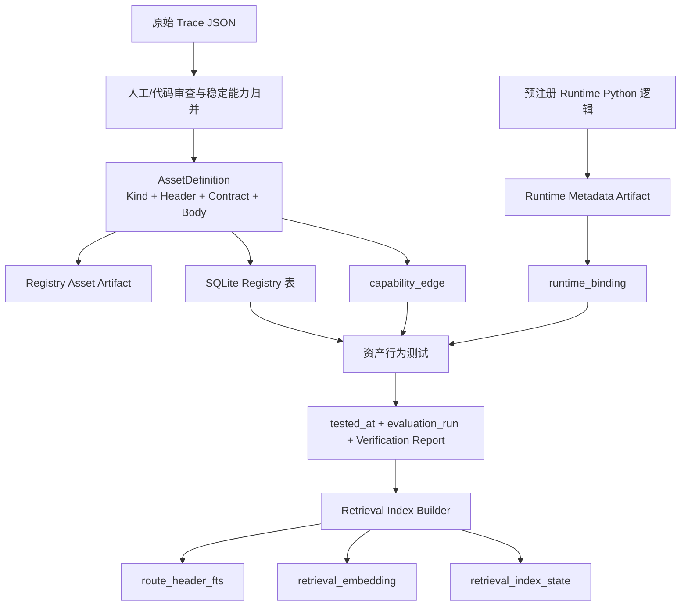
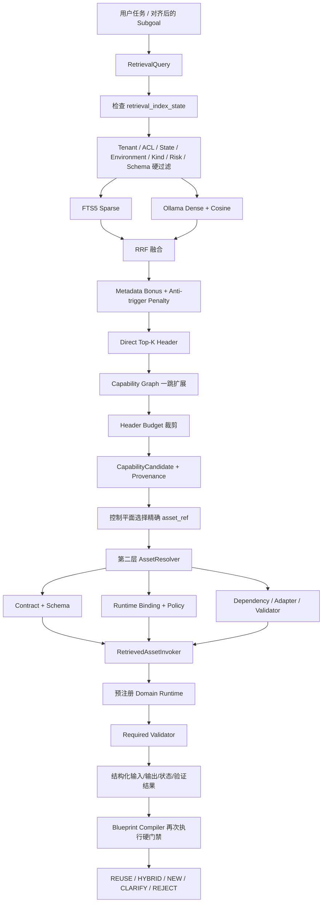

# Data 目录结构与 Trace → Retrieval Layer 数据流说明

> 目标：回答两个问题。  
> Q1：Trace、资产、Runtime 元数据、数据库、索引和验证报告分别存放在哪里？  
> Q2：一个资产如何从 Trace 沉淀出来，并在主程序中被逐层检索、解析和调用？  
> 当前范围：`corporate_operations`、`customer_service`、`financial_report` 三个已完成
> 资产沉淀的 domain。  
> 当前状态：43 条原始 Trace；43 个三域 DRAFT 资产；27 个语义索引文档；
> 16 个 Graph-only 资产；无 ACTIVE Snapshot。

---

## 1. 先理解五类不同的数据

当前 `data/` 下的数据不能都叫“资产”。它们分别承担不同职责：

| 层次 | 它是什么 | 是否直接参与在线检索 | 是否包含实际执行代码 |
| --- | --- | --- | --- |
| 原始 Trace | 合成任务的步骤、输入输出、验证和候选资产证据 | 否 | 否 |
| Registry Asset Artifact | 从 Trace 中审查、归并后形成的不可变资产定义 | 间接；数据库保存其检索投影和路径 | 不包含完整 Python 函数体 |
| Runtime Metadata Artifact | 资产执行方式、政策版本和副作用边界 | 第二层详情解析时使用 | 不包含完整 Python 函数体 |
| SQLite Registry/Retrieval | 资产身份、Header、Contract、关系、状态、FTS 和 Dense Vector | 是，在线检索的主要数据源 | 否 |
| Verification Report | 证明资产和检索闭环实际通过测试 | 否，只供审查 | 否 |

实际的受控业务逻辑函数不在 `data/` 目录，而在：

```text
src/reduce_token_agent/assets_runtime/<domain>.py
```

数据库中的 `implementation_ref` 只是指向预注册代码的稳定引用。系统不会把数据库里
的字符串当成任意 Python 代码执行。

---

## 2. 当前 data/ 目录全景

省略 macOS 自动生成的 `.DS_Store` 后，当前有效结构如下：

```text
data/
├── DATA_LAYOUT_AND_RETRIEVAL_FLOW.md       # 本说明
├── ASSET_EXTRACTION_SOP.md                 # Trace → Asset 标准流程
├── RETRIEVAL_LAYER_SOP.md                  # Asset → Retrieval 标准流程
│
├── traces/
│   ├── synthetic/
│       └── qwen3.5-9b/
│           └── v1/
│               ├── manifest.json
│               ├── COLLECTION_REPORT.md
│               └── records/
│                   ├── corporate_operations/   # 4 条，已抽取资产
│                   ├── customer_service/       # 8 条，已抽取资产
│                   ├── financial_report/       # 8 条，已抽取资产
│                   ├── internal_communication/ # 10 条，尚未抽取
│                   ├── loan_contract/          # 9 条，尚未抽取
│                   └── risk_compliance/         # 4 条，尚未抽取
│
│   └── runtime/
│       └── v1/
│           └── records/<YYYY-MM-DD>/trace_run_*.json
│
├── artifacts/
│   ├── registry/
│   │   ├── corporate_operations/v1/
│   │   │   ├── primitive_tool/
│   │   │   ├── fsm_shard/
│   │   │   ├── workflow_skeleton/
│   │   │   ├── adapter/
│   │   │   └── validator/
│   │   ├── customer_service/v1/
│   │   │   └── <同样五类 kind 目录>
│   │   └── financial_report/v1/
│   │       └── <同样五类 kind 目录>
│   │
│   └── runtime/
│       ├── corporate_operations/v1/        # 13 个 Runtime Metadata
│       ├── customer_service/v1/            # 14 个 Runtime Metadata
│       └── financial_report/v1/             # 16 个 Runtime Metadata
│
├── db/
│   ├── registry.sqlite3                    # Registry + 当前 Retrieval 数据库
│   ├── runtime.sqlite3                     # Control Plane 结构化 Trace（不保存默认 CoT）
│   ├── REGISTRY_REVIEW.md
│   ├── CORPORATE_OPERATIONS_REVIEW.md
│   ├── CUSTOMER_SERVICE_REVIEW.md
│   ├── FINANCIAL_REPORT_REVIEW.md
│   └── RETRIEVAL_REVIEW.md
│
└── reports/
    ├── runtime_verification/
    │   ├── corporate_operations/<timestamp>.json
    │   ├── customer_service/<timestamp>.json
    │   └── financial_report/<timestamp>.json
    ├── retrieval/
    │   └── RETRIEVAL_VERIFICATION.json
    └── trace_review/<trace_id>/
        ├── TRACE_REVIEW.md
        └── TRACE_REVIEW.json
```

`runtime.sqlite3` 当前已经由 Control Plane 使用，保存 `control_run`、
`control_event` 和 `control_blueprint` 三组规划证据表；它只保存结构化事件、错误码、
资产版本、Token/耗时和安全摘要，不默认保存完整思维链。`checkpoints.sqlite3` 仍是
后续 LangGraph Checkpoint 的预留文件，不能与 `registry.sqlite3` 或
`runtime.sqlite3` 混为一谈。

### 3.5 真实运行 Trace

每次 Control Plane 运行结束时，会将数据库中的结构化事件投影为一个稳定的
`runtime-trace.v1` 原始 Trace：

```text
data/traces/runtime/v1/records/<YYYY-MM-DD>/trace_run_<16 hex>.json
```

它与启动用的 Synthetic Trace 保持同样的“任务、步骤/事件、结果、证据、治理”分层，
但明确标记 `synthetic=false`。当前版本包含：

- 安全任务摘要、租户和 Principal 引用、领域、风险、数据级别；
- Normalize、Decompose、Retrieve、SAD、Rerank、Proposal、Compile、Route 的有序事件；
- 固定 Registry View、Blueprint Proposal、Compile Result；
- 失败阶段、稳定错误码、Observed/Validated Asset Ref；
- `RuntimeExecutionStepRecord`，供后续真实执行器记录输入摘要、输出 Artifact、
  Validator、幂等引用和副作用；
- 抽取资格状态：`INELIGIBLE_CONTROL_ONLY`、
  `INELIGIBLE_FAILED_RUN`、`INELIGIBLE_UNVALIDATED_EXECUTION` 或
  `ELIGIBLE_VALIDATED_EXECUTION`。

控制平台尚未执行 LangGraph/System2，因此当前真实运行 Trace 通常是
`INELIGIBLE_CONTROL_ONLY`；这可以审查规划和失败，但不能据此生成可执行新资产。
只有真实执行事件、独立 Validator 通过且 `business_validated=true` 时，后台抽取程序
才允许把它作为 SOP 输入，且仍只能生成 DRAFT。

按 Trace ID 或 Run ID 生成审阅材料：

```bash
python scripts/review_runtime_trace.py trace_run_<16 hex>
python scripts/review_runtime_trace.py run_<16 hex>
```

脚本输出原始 Trace、Markdown 审查报告和 JSON 审查投影的绝对路径。报告按时间线展示
每个阶段、输入/输出安全摘要、资产引用、失败原因、编译错误和抽取资格；重复审阅不会
改变已完成 Trace 的内容。

---

## 3. Q1：每部分数据具体存在哪里

### 3.1 原始 Trace

位置：

```text
data/traces/synthetic/qwen3.5-9b/v1/records/<domain>/trace_syn_*.json
```

单条 Trace 保存：

- `trace_id`、`scenario_id`、`domain`、`task_family`；
- 原始任务、约束、步骤和步骤间引用；
- 每一步的输入、动作、输出 Artifact、验证和失败码；
- 生成阶段提出的候选 Tool/FSM/Adapter/Validator 等提示；
- Provenance、模型、Token、质量标记和治理状态；
- `chain_of_thought_stored=false`。

Trace 是资产抽取的证据，不是可以直接执行的正式资产。Trace 中的
`candidate_assets` 只是线索，不能直接进入 Blueprint。

#### Trace 数据集总目录

```text
data/traces/synthetic/qwen3.5-9b/v1/manifest.json
```

Manifest 保存当前 43 条有效 Trace 的：

- 相对路径；
- Domain 和 Scenario；
- 文件 SHA-256；
- Candidate Kind；
- Operation Coverage；
- Quality Score/Flags；
- 生成尝试次数和 Token。

```text
data/traces/synthetic/qwen3.5-9b/v1/COLLECTION_REPORT.md
```

这是面向人工审查的采集汇总，不是索引。

#### 当前哪些 Trace 已进入资产层

| domain | Trace 数 | 是否已抽取资产 | 是否进入 Retrieval |
| --- | ---: | --- | --- |
| `corporate_operations` | 4 | 是 | 是 |
| `customer_service` | 8 | 是 | 是 |
| `financial_report` | 8 | 是 | 是 |
| `internal_communication` | 10 | 否 | 否 |
| `loan_contract` | 9 | 否 | 否 |
| `risk_compliance` | 4 | 否 | 否 |

所以当前是：

```text
43 条原始 Trace
  ├── 20 条作为三域资产的来源证据
  └── 23 条仍只停留在原始 Trace 层
```

Trace 与资产不是一对一关系。多个 Trace 可以被归并为一个稳定资产；一条 Trace
也可以为 Tool、FSM、Adapter、Validator 等多个资产提供不同证据。

---

### 3.2 Registry Asset Artifact

位置：

```text
data/artifacts/registry/<domain>/v1/<kind>/<asset-file>.json
```

当前数量：

| kind 目录 | 数量 |
| --- | ---: |
| `primitive_tool` | 11 |
| `fsm_shard` | 13 |
| `workflow_skeleton` | 3 |
| `adapter` | 3 |
| `validator` | 13 |
| 合计 | 43 |

每个 Artifact 是某个 `asset_ref=id@version` 的不可变定义，主要包含：

```text
asset_id + version + kind + domain
route_header
contract
body
source_evidence
test_suite_ref
release_status=DRAFT
```

其中：

- `route_header`：供检索使用的小体量说明；
- `contract`：输入输出 Schema、前置条件、效果、Scope、风险和失败模式；
- `body`：FSM 状态图、Tool Handler 声明、Adapter 映射、Validator 规则或
  DAEF 阶段；
- `source_evidence`：回指 Trace 的 `trace_id/scenario_id/step_ids/candidate_ids`；
- `test_suite_ref`：说明该资产应该由哪套测试证明。

示例：

```text
data/artifacts/registry/financial_report/v1/fsm_shard/
fsm__financial_report__reconciliation__balance_sheet_route@1.0.0.json
```

它描述“资产负债表勾稽路由”的身份、Contract、状态图和 Trace 来源，但真正执行
差额计算的 Python 函数仍在 `assets_runtime/financial_report.py`。

Artifact 文件名是文件系统安全编码：

```text
asset_ref:
fsm.financial_report.reconciliation.balance_sheet_route@1.0.0

artifact filename:
fsm__financial_report__reconciliation__balance_sheet_route@1.0.0.json
```

不要通过猜文件名来调用资产。主程序始终使用数据库中的完整 `asset_ref` 和
`artifact_path`。

---

### 3.3 Runtime Metadata Artifact

位置：

```text
data/artifacts/runtime/<domain>/v1/<encoded-asset-ref>.json
```

当前三域 43 个资产各有一份 Runtime Metadata。它保存：

```text
asset_ref
implementation_ref
execution_mode
policy_version
business_rules
side_effect
```

示例：

```text
asset_ref:
fsm.financial_report.reconciliation.balance_sheet_route@1.0.0

implementation_ref:
python://reduce_token_agent.assets_runtime.financial_report:
balance_sheet_reconciliation_route
```

这里的文件是执行绑定的审计元数据，不是 Python 源代码。实际逻辑体位于：

```text
src/reduce_token_agent/assets_runtime/financial_report.py
```

数据库通过 `runtime_binding.metadata_path` 和 `metadata_digest` 指向并校验这份
Runtime Metadata。

---

### 3.4 SQLite Registry 与 Retrieval 数据

位置：

```text
data/db/registry.sqlite3
```

当前 PoC 为简化部署，把 Registry 表和 Retrieval 投影放在同一个 SQLite 文件，
但通过不同表和 Repository 隔离职责。

#### 资产身份与版本

| 表 | 保存内容 |
| --- | --- |
| `asset` | `asset_id`、kind、domain、owner |
| `asset_version` | `asset_ref`、version、完整 Contract JSON、Artifact 路径和摘要、来源 Trace ID |
| `asset_release` | DRAFT/ACTIVE 状态、风险、Scope、验证状态 |

#### 检索 Header 与关系

| 表 | 保存内容 |
| --- | --- |
| `route_header` | 名称、摘要、正向/反向触发、关键词、输入输出摘要、Recall Policy |
| `capability_edge` | FSM 到 Tool/Adapter/Validator 的显式一跳关系 |

#### 可执行性与评测

| 表 | 保存内容 |
| --- | --- |
| `runtime_binding` | 实现引用、执行模式、政策版本、Runtime Metadata 路径、状态、`tested_at` |
| `evaluation_run` | 测试套件、指标、PASS/FAIL 和测试时间 |

#### Retrieval 索引

| 表 | 保存内容 |
| --- | --- |
| `route_header_fts` | 27 个可语义召回 Header 的 FTS5 文本 |
| `retrieval_embedding` | 27 个 Header 的 Dense Vector、模型、维度和内容摘要 |
| `retrieval_index_state` | Index ID、可见性策略、Embedding 模型、资产集摘要、文档数 |

#### 发布治理

| 表 | 当前状态 |
| --- | --- |
| `registry_snapshot` | 0 条，尚未创建 ACTIVE Snapshot |
| `snapshot_member` | 0 条 |

当前 `retrieval_index_state` 是开发期索引：

```text
visibility_policy = VALIDATED_DRAFT
snapshot_id = null
embedding_model = qwen3-embedding:0.6b
document_count = 27
```

这不等于资产已经发布为 ACTIVE。

---

### 3.5 为什么只有 27 个语义索引文档，而资产有 43 个

43 个资产按召回策略分为：

```text
27 个语义索引文档
  ├── 24 个 ORDINARY：FSM_SHARD + PRIMITIVE_TOOL
  └──  3 个 PLANNING_PRIOR：WORKFLOW_SKELETON

16 个不进普通语义索引
  └── GRAPH_ONLY：ADAPTER + VALIDATOR
```

原因：

- FSM/Tool 可以根据用户任务或子目标直接召回；
- Skeleton 是独立规划先验，不能和普通执行能力混搜；
- Adapter/Validator 不应因为语义相似就被随意选中，只能根据已经选中的主资产，
  通过显式 `capability_edge` 补入。

因此“没有 Dense Vector”不代表 Adapter/Validator 不可用，而是它们采用更安全的
Graph-only 加入方式。

---

### 3.6 验证报告

#### 单资产运行验证

```text
data/reports/runtime_verification/<domain>/<timestamp>.json
```

记录：

- 精确 `asset_ref`；
- 输入 Payload 和来源；
- 输出 Payload；
- 执行状态；
- Required Validator 和 Validator 输出；
- Runtime 验证状态；
- 成功/失败、错误和时间；
- `tested_at` 写入结果。

#### Retrieval 闭环验证

```text
data/reports/retrieval/RETRIEVAL_VERIFICATION.json
```

记录：

- 查询文本和 Domain；
- 期望 Top-1 与真实 Top-1；
- Direct/Graph Candidate；
- 资产说明、Contract/Schema 和调用方式；
- Sample Payload；
- 实际 Runtime 输出；
- Validator 状态；
- 整个案例是否通过。

#### 人工审查报告

```text
data/db/<DOMAIN>_REVIEW.md
data/db/REGISTRY_REVIEW.md
data/db/RETRIEVAL_REVIEW.md
```

它们是便于阅读的审查结果，不被主程序作为运行事实读取。

---

## 4. 贯穿所有数据层的主键：asset_ref

理解数据关联时，最重要的是区分四个 ID：

| 标识 | 示例 | 作用 |
| --- | --- | --- |
| `trace_id` | `trace_syn_financial_report_01_balance_sheet_reconcile` | 回到原始来源证据 |
| `asset_id` | `fsm.financial_report.reconciliation.balance_sheet_route` | 资产逻辑身份 |
| `version` | `1.0.0` | 不可变版本 |
| `asset_ref` | `fsm.financial_report.reconciliation.balance_sheet_route@1.0.0` | 数据库、关系、索引、Blueprint 和 Runtime 的统一引用 |

资产沉淀之后，主程序不再用 `trace_id` 调用能力，而是用完整 `asset_ref`：

```text
asset_ref = asset_id + "@" + version
```

`asset_ref` 同时连接：

```text
asset_version
  ├── asset
  ├── asset_release
  ├── route_header
  ├── runtime_binding
  ├── evaluation_run
  ├── capability_edge
  ├── route_header_fts
  └── retrieval_embedding
```

---

## 5. 从 Trace 到可检索资产的离线流程

这一阶段不是在线用户请求触发的，而是资产建设流程。



### Step 1：生成并校验 Trace

脚本：

```text
scripts/generate_synthetic_traces.py
```

输出 Trace JSON、Manifest 和采集报告。这个阶段只产生候选证据，不创建正式资产。

### Step 2：按 Domain 审查和归并

依据：

```text
data/ASSET_EXTRACTION_SOP.md
```

审查目标不是保存 Trace 的所有细节，而是寻找未来 Blueprint 可以复用的稳定边界：

- 一个受控单操作成为 `PRIMITIVE_TOOL`；
- 一个可独立完成稳定子目标的小状态图成为 `FSM_SHARD`；
- DAEF 宏观阶段成为 `WORKFLOW_SKELETON`；
- 确定性字段转换成为 `ADAPTER`；
- 完成状态证明成为 `VALIDATOR`。

这个步骤会重新设计粒度，因此 Trace Candidate 不会被机械地一比一复制。

### Step 3：生成不可变 Asset Artifact

Seed 代码将通过 Pydantic 校验的 AssetDefinition 写入：

```text
data/artifacts/registry/<domain>/v1/<kind>/
```

同时计算 Artifact Digest。相同 `asset_ref` 如果内容发生冲突，会被不可变版本检查
拒绝，必须创建新版本。

### Step 4：写入 Registry

同一资产拆分写入：

```text
asset
asset_version
asset_release
route_header
evaluation_run
```

关系写入：

```text
capability_edge
```

这一步建立“可检索说明”和“完整执行 Contract”的分层，但仍然全部是 DRAFT。

### Step 5：绑定本地 Runtime

Runtime 逻辑体在：

```text
src/reduce_token_agent/assets_runtime/<domain>.py
```

其审计元数据写入：

```text
data/artifacts/runtime/<domain>/v1/
runtime_binding
```

`WORKFLOW_SKELETON` 的 `execution_mode=PLANNING_ONLY`；其他可用资产为
`EXECUTABLE`。

### Step 6：执行资产行为测试

测试位置：

```text
tests/assets/<domain>/
```

通用验证器：

```text
scripts/verify_asset_runtime.py
```

验证成功后：

- `runtime_binding.tested_at` 被写入；
- `evaluation_run.metrics_json.runtime_behavior_tested=true`；
- 可执行资产保持 `READY`；
- Skeleton 保持 `PLANNING_ONLY`；
- 生成 Runtime Verification Report。

### Step 7：构建 Retrieval Index

脚本：

```text
scripts/build_retrieval_index.py
```

当前开发期入选条件：

```text
asset_release.status = DRAFT
asset_release.validation_status = PASS
runtime_binding.tested_at IS NOT NULL
runtime_binding.runtime_status IN (READY, PLANNING_ONLY)
recall_policy IN (ORDINARY, PLANNING_PRIOR)
```

Index Builder 从 `route_header` 生成两份检索投影：

1. 中文 n-gram FTS 文本写入 `route_header_fts`；
2. Header 文本经 Ollama `qwen3-embedding:0.6b` 生成向量，写入
   `retrieval_embedding`。

最后写入 `retrieval_index_state`，但不修改资产的 DRAFT 状态。

---

## 6. Q2：主程序如何逐层召回某个资产

在线召回分为两个大层次：

```text
第一层：找“可能相关的资产 Header”
第二层：对选中的精确 asset_ref 加载“怎么调用”
```

不是一开始就把 43 个完整 Asset Body 和所有 Python 实现交给模型。



### 在线 Step 1：形成 RetrievalQuery

调用入口：

```text
src/reduce_token_agent/control_plane/capability_retrieval.py
```

查询至少包含：

```text
text
phase
domains
kinds
scopes
tenant_id
environment
data_classification
risk_ceiling
top_k
graph_top_k
visibility_policy
snapshot_id
```

其中：

- `INITIAL`：对完整任务做初始 Header 召回；
- `PER_SUBGOAL`：SAD 后对单个子目标再次召回；
- `PLANNING_PRIOR`：只召回 `WORKFLOW_SKELETON`。

Control Plane 主流程已在 `control_plane/service.py` 串接 Normalize、粗拆、初始召回、
SAD 一次和 Per-Subgoal Retrieval；后续阶段仍必须使用同一个固定索引视图。

### 在线 Step 2：固定并检查索引视图

主程序先读取：

```text
retrieval_index_state
```

确认：

- Query 的可见性策略与索引一致；
- Embedding 模型一致；
- 如果将来是 ACTIVE 模式，`snapshot_id` 必须一致；
- 当前 `asset_set_digest` 已固定。

当前使用 `VALIDATED_DRAFT`，不会谎称存在 ACTIVE Snapshot。

### 在线 Step 3：执行硬过滤

从当前可见 Header 中先过滤：

- Domain 是否允许；
- Kind 是否属于本次查询；
- Tenant/Contract Scope 是否匹配；
- Environment 和 Data Classification 是否匹配；
- 状态为可见 DRAFT/ACTIVE，且 Runtime Binding 已测试并可用；
- Caller Scope 是否覆盖资产 `required_scopes`；
- Risk 是否不超过 `risk_ceiling`；
- Artifact Schema Version 是否受当前控制平台支持；
- 普通任务只看 `ORDINARY`；
- 规划先验只看 `PLANNING_PRIOR`。

硬过滤发生在打分之前。一个用户没有 `vendor:read` Scope 时，即使语义上非常像
“供应商状态查询”，该 Tool 也不会被召回。

### 在线 Step 4：Sparse 与 Dense 双通道召回

#### Sparse

查询 `route_header_fts`：

- 精确业务词；
- 工具名；
- 关键词；
- 中文 2～4 字 n-gram。

它擅长“报销、票据、勾稽、欺诈、供应商”等明确术语。

#### Dense

流程：

```text
Query Text
  → qwen3-embedding:0.6b
  → L2 Normalize
  → 与 retrieval_embedding 中的 Header Vector 做 NumPy Cosine
  → Dense Rank
```

它负责发现措辞不同但语义相近的 Header。

### 在线 Step 5：RRF 融合与确定性修正

Sparse Rank 与 Dense Rank 通过 RRF 融合，避免直接比较 BM25 和 Cosine 的不同
分值尺度。

之后增加：

- Domain 精确匹配；
- Positive Trigger/Keyword 命中；
- FSM 的小幅稳定优先；
- Anti-trigger 命中的负向惩罚。

响应会保留：

```text
sparse_rank / sparse_score
dense_rank / dense_score
rrf_score
metadata_bonus
anti_trigger_penalty
```

所以可以解释“为什么这个资产被召回”，而不是只返回一个不透明的总分。

### 在线 Step 6：得到 Direct Top-K Header

这个阶段只返回小体量：

```text
asset_ref
kind / domain
name / summary
input_type_summary / output_type_summary
risk / scopes
rank / score / provenance
```

不返回完整 Body，也不加载 Python 代码。

### 在线 Step 7：Capability Graph 一跳补全

对 Direct Top-K 使用 `capability_edge`，只扩展一跳：

```text
DEPENDS_ON
REQUIRES_VALIDATOR
COMPATIBLE_VIA_ADAPTER
```

例如召回一个 FSM 后，可以补入：

- FSM 内部依赖的只读 Tool；
- 输入 Contract 需要的 Adapter；
- 完成状态必须经过的 Validator。

Graph Candidate 会明确记录：

```text
source = GRAPH_EXPANSION
parent_ref
edge_type
edge_evidence
```

系统不会递归搜索无限能力图。

### 在线 Step 8：Header Budget 裁剪

Direct Candidate 与 Graph Candidate 按预算裁剪，确保交给后续计划组件的是有限、
可解释的 Header 集合。

输出类型：

```text
RetrievalResult
  ├── index_id
  ├── asset_set_digest
  ├── embedding_model
  ├── candidates[]
  ├── direct_count
  ├── graph_expansion_count
  └── truncated_by_budget
```

### 在线 Step 9：选择精确 asset_ref

控制平面从 Candidate 中选择一个明确版本：

```text
fsm.corporate_ops.expense.pre_audit@1.0.0
```

从这里开始才进入第二层详情读取。未来 Blueprint 也必须记录完整 `asset_ref`，不能
只记录模糊名称“费用预审”。

### 在线 Step 10：第二层解析调用方式

入口：

```text
src/reduce_token_agent/registry/service.py
AssetResolver.resolve(asset_ref)
```

它按 `asset_ref` 联表读取：

```text
asset + asset_version + asset_release
route_header + runtime_binding + capability_edge
```

返回 `AssetDetails`：

- 完整 Contract；
- 输入/输出 JSON Schema；
- 预条件、效果和失败码；
- `implementation_ref`；
- `execution_mode`、`runtime_status`、`tested_at`；
- `policy_version`；
- Sample Payload；
- Required Validator；
- Artifact/Runtime Metadata 路径和 Digest；
- 一跳关联资产。

### 在线 Step 11：受控执行

入口：

```text
RetrievedAssetInvoker.invoke(asset_ref, payload)
```

执行前检查：

- `validation_status=PASS`；
- `tested_at` 非空；
- Runtime 是 `READY` 或 `PLANNING_ONLY`；
- 根据 Domain 加载预注册 Runtime Class；
- 使用精确 `asset_ref` 选择固定 Handler。

执行结果记录：

```text
input_payload
output_payload
execution_status
validator_ref
validator_output
validation_status_runtime
success
error
started_at / finished_at
```

如果主资产有 `REQUIRES_VALIDATOR`，主资产成功并不等于最终成功，Validator 也必须
返回 `valid=true`。

`WORKFLOW_SKELETON` 只读取规划先验，不调用执行函数：

```text
execution_status = SKIPPED
validation_status_runtime = NOT_APPLICABLE
success = true
```

这表示它正确履行了“只规划、不执行”的边界。

---

## 7. 一个完整实例：费用报销预审 FSM 如何被召回

### 7.1 用户子目标

```text
预审差旅费用报销，检查重复票据和住宿是否超过标准
```

### 7.2 第一层直接召回

FTS 与 Dense 都会指向：

```text
fsm.corporate_ops.expense.pre_audit@1.0.0
```

对应 Header：

```text
name: 费用报销预审
summary: 完成重复票据检查、住宿标准校验和人工复核路由
input: ExpenseClaimFacts
output: ExpensePreAuditDecision
recall_policy: ORDINARY
```

### 7.3 一跳关系补全

`capability_edge` 为该 FSM 补入：

```text
DEPENDS_ON
  → tool.corporate_ops.expense.duplicate_receipt_check@1.0.0

REQUIRES_VALIDATOR
  → validator.corporate_ops.expense.pre_audit@1.0.0
```

Tool 和 Validator 不需要分别依赖一次全库语义猜测。

### 7.4 第二层加载

选中 FSM 的精确 `asset_ref` 后，系统读取：

```text
asset_version.contract_json
runtime_binding.implementation_ref
runtime_binding.policy_version
runtime_binding.tested_at
capability_edge
```

得到：

```text
implementation_ref:
python://reduce_token_agent.assets_runtime.corporate_operations:
expense_pre_audit

policy_version:
expense-policy.synthetic.cn.v1

required_validator:
validator.corporate_ops.expense.pre_audit@1.0.0
```

### 7.5 执行与验证

运行顺序：

```text
ExpenseClaimFacts
  → expense_pre_audit Runtime
  → ExpensePreAuditDecision
  → expense.pre_audit Validator
  → valid=true
```

完整输入、输出和状态最终可以在以下报告中审查：

```text
data/reports/retrieval/RETRIEVAL_VERIFICATION.json
```

---

## 8. 给定 asset_ref，如何手工找到它的全部数据

假设：

```text
fsm.financial_report.reconciliation.balance_sheet_route@1.0.0
```

### 8.1 找不可变 Asset Artifact

先查询数据库的 `asset_version.artifact_path`，当前对应：

```text
data/artifacts/registry/financial_report/v1/fsm_shard/
fsm__financial_report__reconciliation__balance_sheet_route@1.0.0.json
```

### 8.2 找 Runtime Metadata

查询 `runtime_binding.metadata_path`，当前对应：

```text
data/artifacts/runtime/financial_report/v1/
fsm__financial_report__reconciliation__balance_sheet_route__1__0__0.json
```

### 8.3 找实际执行函数

读取 `runtime_binding.implementation_ref`：

```text
python://reduce_token_agent.assets_runtime.financial_report:
balance_sheet_reconciliation_route
```

对应源码：

```text
src/reduce_token_agent/assets_runtime/financial_report.py
```

### 8.4 找来源 Trace

读取 `asset_version.source_trace_ids_json` 或 Artifact 的 `source_evidence`：

```text
trace_syn_financial_report_01_balance_sheet_reconcile
```

对应：

```text
data/traces/synthetic/qwen3.5-9b/v1/records/financial_report/
trace_syn_financial_report_01_balance_sheet_reconcile.json
```

### 8.5 找依赖和 Validator

查询：

```text
capability_edge.from_ref = 当前 asset_ref
```

可以看到标准视图 Adapter、公式 Tool 和资产负债表 Validator。

### 8.6 确认是否进入语义索引

检查：

```text
route_header.recall_policy
route_header_fts.asset_ref
retrieval_embedding.asset_ref
```

该 FSM 为 `ORDINARY`，所以同时存在 FTS 和 Dense Vector。

如果是 Validator，则通常只存在 `route_header` 和 `capability_edge`，不在
`route_header_fts/retrieval_embedding` 中。

---

## 9. 哪些文件是事实源，哪些只是报告

| 数据 | 角色 |
| --- | --- |
| Trace JSON | 原始证据事实 |
| Registry Asset Artifact | 不可变资产定义和 Body 事实 |
| Runtime Python 源码 | 实际执行逻辑事实 |
| Runtime Metadata Artifact | 实现绑定与政策审计事实 |
| `registry.sqlite3` | 在线状态、Contract、Header、关系和索引事实 |
| Verification JSON | 某次验证运行的证据 |
| Review Markdown | 人工可读汇总，不作为主程序事实源 |

主程序不应从 Review Markdown 或报告文本中解析资产调用方式。

---

## 10. 当前尚未发生的流程

以下能力当前没有实现，阅读数据时不要误认为已经存在：

- `internal_communication`、`loan_contract`、`risk_compliance` 尚未抽取资产；
- 尚未人工 Activate 任何资产；
- `registry_snapshot` 和 `snapshot_member` 为空；
- 当前 Run 尚未固定正式 ACTIVE Snapshot；
- LangGraph Meta-Executor、System2 推理循环、Runtime Ledger 执行步循环尚未建立；
- `runtime.sqlite3` 已由 Control Plane 使用，`checkpoints.sqlite3` 尚未创建；
- 当前自然语言主程序已完成到 Blueprint 编译/路由，但下游占位端口不会执行业务。

下一阶段接入主程序时，应直接复用现有 `RetrievalQuery → RetrievalResult →
AssetResolver → RetrievedAssetInvoker` 边界，不能另建一套绕过 Contract、Scope、
Runtime Binding 或 Validator 的快捷调用路径。

---

## 11. 最简记忆方式

如果只记住一条链路，请记住：

```text
Trace JSON
  → 人工审查与能力归并
  → Registry Asset Artifact
  → SQLite 的 Header / Contract / Edge / Runtime Binding
  → 行为测试写入 tested_at
  → FTS + Dense 构建 Header 索引
  → 用户任务召回 Direct Header
  → Graph 一跳补齐 Tool / Adapter / Validator
  → 选择精确 asset_ref
  → 第二层加载 Contract 和调用方式
  → 预注册 Runtime 执行
  → Required Validator 验证
  → 结构化结果与审计报告
```

配套规范：

```text
Trace → Asset：data/ASSET_EXTRACTION_SOP.md
Asset → Retrieval：data/RETRIEVAL_LAYER_SOP.md
当前数据地图：data/DATA_LAYOUT_AND_RETRIEVAL_FLOW.md
```
