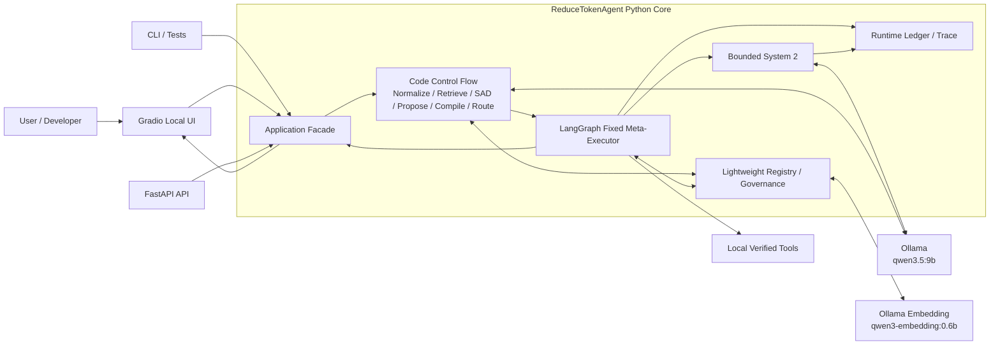
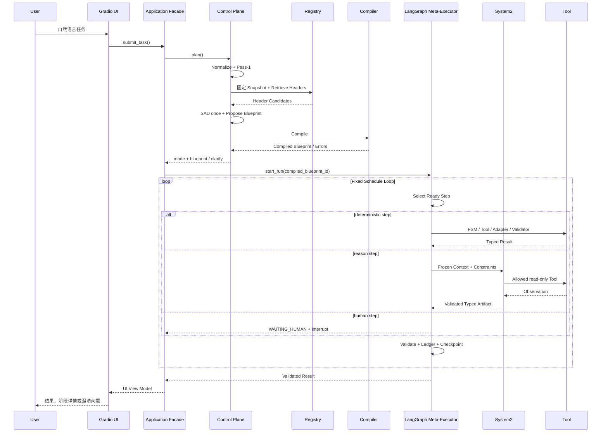

# ReduceTokenAgent 项目结构与组件实现设计

> 文档角色：定义本地 PoC 的组件边界、目录组织、数据流、接口、最小数据模型和实现顺序  
> 配套约束：`AGENTS.md`  
> 上位设计：`../DESIGN_MEMORY.md`  
> 当前版本：PoC Architecture v0.2  
> 日期：2026-08-13

---

## 1. 结论

该 PoC 采用“**本地 Ollama + 单体模块化 Python Core + 同进程 Gradio UI**”：

- 不部署 Dify；只借鉴其控制平面思路，由 Python 代码显式实现控制流；
- Gradio 提供本地可视化入口、阶段展示、组件实验、结果查看和 Human 交互；
- Python Control Flow 实现 Task Normalize、Retrieval、SAD、Plan Proposal、Compiler、Mode Router；
- LangGraph 在 Python Core 内运行固定 Meta-Executor；
- System 2 是 Meta-Executor 的一个受限 Executor；
- SQLite + FTS5 + 本地 Artifact 实现最小 Registry/Governance；
- Ollama `qwen3.5:9b` 负责结构化规划和局部推理；
- Ollama `qwen3-embedding:0.6b` 负责 Dense Retrieval；
- 首版只使用本地模拟 Tool，避免企业系统接入掩盖核心假设。

这是可行的最小闭环，不要求先部署生产级数据库、消息队列、对象存储或治理平台。

---

## 2. 可行性核对

### 2.1 已核对的官方能力

| 能力 | 结论 | 对本项目的作用 |
| --- | --- | --- |
| Gradio 挂载 FastAPI | 官方支持将 `Blocks` 直接挂载到现有 FastAPI | UI 和 API 同进程运行 |
| Gradio Blocks/Tabs | 官方提供组件、事件和 Tab 布局 | 构建 Playground、Inspector 和 Component Lab |
| Ollama `qwen3.5:9b` | 官方 Library 存在 9B Tag；常用量化约 6.6GB | Agent 内核模型 |
| Ollama Tool Calling | 官方 API 支持单次、多工具和多轮 Tool Calling | System 2 受限工具选择 |
| Ollama Structured Outputs | 官方 API 可用 JSON Schema 约束响应 | Normalizer、SAD、Blueprint、Reason Artifact |
| Ollama Embeddings | 官方 `/api/embed` 支持批量 Embedding | Dense Retrieval |
| `qwen3-embedding:0.6b` | 官方 Library 提供约 639MB 的 0.6B 模型 | 小体量本地 Embedding |
| LangGraph Persistence | 官方 Checkpointer 保存每步状态 | 故障恢复和 Interrupt |
| LangGraph SQLite | 官方说明适合实验和本地工作流 | PoC Checkpoint |
| LangGraph Interrupt | 官方支持持久化暂停与同 thread 恢复 | 澄清和人工审批 |
| SQLite FTS5 | SQLite 内建全文检索能力 | Sparse Retrieval |
| `sqlite-vec` | 体量小但官方仓库标注 pre-v1 | 仅作为可选优化，不作首版依赖 |

### 2.2 官方参考

- [Gradio 挂载 FastAPI](https://www.gradio.app/main/docs/gradio/mount_gradio_app)
- [Gradio Blocks](https://www.gradio.app/main/docs/gradio/blocks)
- [Gradio Tab](https://www.gradio.app/main/docs/gradio/tab)
- [Ollama qwen3.5 Tags](https://ollama.com/library/qwen3.5/tags)
- [Ollama Tool Calling](https://docs.ollama.com/capabilities/tool-calling)
- [Ollama Structured Outputs](https://docs.ollama.com/capabilities/structured-outputs)
- [Ollama Embedding API](https://docs.ollama.com/api/embed)
- [Ollama qwen3-embedding](https://ollama.com/library/qwen3-embedding)
- [LangGraph Persistence](https://docs.langchain.com/oss/python/langgraph/persistence)
- [LangGraph Interrupts](https://docs.langchain.com/oss/python/langgraph/interrupts)
- [sqlite-vec 官方仓库](https://github.com/asg017/sqlite-vec)

### 2.3 本机核对

当前机器已安装 Conda 25.11.1，项目根目录内的 `.conda` 环境已经创建，使用 Python 3.12.13。运行、UI、LangGraph、Ollama SDK 和开发测试依赖已从 `pyproject.toml` 安装。用户已确认 Ollama 和 `qwen3.5:9b` 已安装，但检查时 Ollama Server 未处于运行状态。因此：

- Python Core 与 Gradio UI 可以直接开始实现；
- 环境声明由 `environment.yml` + `pyproject.toml` 管理，`.conda` 不提交；
- 模型集成测试前需确认 Ollama 服务已启动；
- `qwen3-embedding:0.6b` 仍需在进入 Dense Retrieval 前核对。

---

## 3. 总体逻辑架构



### 3.1 部署单元

首版只有两个本地运行单元：

1. `ollama`：本机模型服务；
2. `reduce-token-agent`：单 Python 进程，同时提供 FastAPI `/api` 与 Gradio `/ui`。

### 3.2 当前交付边界

当前实现已到达 Control Plane + 有界 System2 + 固定 LangGraph Meta-Executor 的确定性执行闭环：

```text
TaskRequest
  -> Normalize（身份/时间/实体/数据级别/风险）
  -> 粗拆高层 Subgoal
  -> 固定 Retrieval Index View
  -> Sparse + Dense + Metadata + Graph -> RRF/Contract Rerank
  -> SAD 一次（只看 Header + Contract Summary）
  -> 受候选白名单约束的 Blueprint Proposal
  -> Deterministic Compiler Hard Gates
  -> REUSE / HYBRID / NEW / CLARIFY / REJECT
  -> 已编译 Blueprint 交接
  -> System2（仅处理 REASON/EXTRACT/HUMAN 缺口）
  -> Fixed LangGraph Meta-Executor
  -> Step 执行 / Validator / Runtime Ledger / Checkpoint
  -> Guard-safe structured output + Trace
```

`execution/graph.py` 和 `execution/meta_executor.py` 已实现固定父图，只接受
Compiler 通过且版本视图一致的 Blueprint；Checkpoint 与 Runtime Ledger 分库存放。
`system2/executor.py` 实现冻结上下文、缺口分类、只读 Tool Gateway、预算检查、
Evidence/Artifact 验证和显式 HUMAN/SAFE_STOP 分流。Hybrid 的 System2 结果回接
固定 LangGraph；New 任务由 System2 独立落 Ledger/Trace。`system2/port.py` 仍是
唯一交接边界，不允许绕过 Compiler、Policy 或 Snapshot。

Python Core 内部按模块分层，但不提前拆微服务，也不创建独立 Node 前端。

DM-11在上述主流程外增加了默认关闭的Application入口分支：

```text
ApplicationFacade.execute_task
  -> feature/identity/environment gate
  -> Robot descriptor exact discovery + Direct Admission Gate
       -> DM_DIRECT：Robot Nexus单轮执行与Validator
       -> CONTROL_PLANE：原ApplicationFacade.plan_task，流程和覆盖率公式不变
```

该快速路径不是新的`PipelineMode`，也不进入Blueprint或固定LangGraph。DM-12已为复杂任务实现
Runtime Dispatcher：普通FSM Step继续保持`StepType.FSM + asset_ref`，执行期再依据冻结Binding选择
`LOCAL_PYTHON`或`ROBOT_NEXUS_HTTP`。Nexus返回问题时运行结果为`PARTIAL + USER_INPUT_REQUIRED`，
后续使用同一run/thread/Blueprint/dialog恢复，不重新Proposal或Compile。DM-13已把Direct和
Blueprint内DM的发现/Gate、Binding、会话摘要引用、逐条异步消息、恢复/失败、最终输出和Token
可见性写入统一`runtime-trace.v1`；DM-14已完成CLI/API/Gradio的真实多轮输入、Nexus
CloudEvents callback、多消息聚合和原dialog恢复，且HUMAN审批仍是独立入口。

恢复轮次必须把该Conversation已持久化的全部机器人`messageNo`作为`seen_message_nos`交给
Nexus观察器；执行层还必须按Repository中的`turn_id`再次过滤历史重复消息。旧消息不得进入
本轮用户对话、Validator或`final_message_cursor`，否则保持硬门禁并返回结构化失败，禁止将
仓储CAS异常直接泄漏到UI。

---

## 4. 在线请求时序



重要边界：

- UI 不直接提交未经编译的任意 Blueprint 到执行器；
- UI 与 API 都调用同一个 Application Facade；
- Registry 召回只返回 Header；
- Executor 不重新做语义规划；
- System 2 不能修改 Blueprint 其他 Step；
- Human Resume 必须使用原 `run_id/thread_id`。

---

## 5. 预期目录结构

下列是代码应按阶段逐步建立的目标结构。环境配置、最小可安装包和 Smoke Tests 已创建，其余目录不为追求形式完整而提前生成空文件。

```text
ReduceTokenAgent/
├── AGENTS.md
├── PROJECT_STRUCTURE.md
├── README.md
├── pyproject.toml
├── environment.yml
├── .env.example
├── .gitignore
├── .conda/                     # 本地已创建，始终 gitignore
│
├── config/
│   ├── app.example.yaml
│   ├── budgets.example.yaml
│   └── prompts/
│       ├── normalizer.md
│       ├── decompose.md
│       ├── sad_align.md
│       ├── plan_proposer.md
│       └── bounded_reason.md
│
├── src/
│   └── reduce_token_agent/
│       ├── __init__.py
│       ├── main.py
│       ├── trace_data/
│           ├── __init__.py
│           ├── catalog.py
│           ├── models.py
│           ├── runtime_models.py
│           ├── runtime_store.py
│           ├── review.py
│           └── generator.py
│       │
│       ├── application/
│       │   ├── container.py
│       │   ├── facade.py             # plan_task保持不变，execute_task增加外层路由
│       │   ├── task_router.py        # feature-flagged DM_DIRECT/原Control Plane
│       │   ├── dm_direct_gate.py     # 唯一候选、治理与策略确定性门禁
│       │   ├── dm_direct_executor.py # SIT Nexus单轮调用、Validator与Conversation落库
│       │   └── view_models.py
│       │
│       ├── api/
│       │   ├── app.py
│       │   ├── dependencies.py
│       │   ├── error_handlers.py
│       │   └── routes/
│       │       ├── health.py
│       │       ├── capabilities.py
│       │       ├── plans.py
│       │       ├── runs.py
│       │       └── governance.py
│       │
│       ├── ui/
│       │   ├── app.py
│       │   ├── handlers.py
│       │   ├── state.py
│       │   └── tabs/
│       │       ├── task_playground.py
│       │       ├── pipeline_inspector.py
│       │       ├── component_lab.py
│       │       ├── registry_browser.py
│       │       ├── run_inspector.py
│       │       ├── human_interrupt.py
│       │       └── benchmark.py
│       │
│       ├── domain/
│       │   ├── enums.py
│       │   ├── errors.py
│       │   ├── ids.py
│       │   ├── task.py
│       │   ├── capability.py
│       │   ├── contract.py
│       │   ├── blueprint.py
│       │   ├── runtime.py
│       │   ├── trace.py
│       │   ├── dm.py              # 直接DM gRPC诊断Contract
│       │   ├── dm_conversation.py # Nexus Conversation/Turn/Cursor持久化Contract
│       │   ├── dm_policy.py       # DM策略证明、观察与门禁结果Contract
│       │   ├── dm_nexus.py        # 正式Nexus异步对话Contract
│       │   └── dm_execution.py    # DM FSM与Runtime Dispatcher执行结果Contract
│       │
│       ├── control_plane/
│       │   ├── service.py
│       │   ├── config.py
│       │   ├── errors.py
│       │   ├── normalizer.py
│       │   ├── decomposer.py
│       │   ├── capability_retrieval.py
│       │   ├── sad_aligner.py
│       │   ├── contract_reranker.py
│       │   ├── plan_proposer.py
│       │   ├── blueprint_compiler.py
│       │   ├── mode_router.py
│       │   ├── failure_router.py
│       │   ├── output_guard.py
│       │   └── trace_recorder.py
│       │
│       ├── execution/
│       │   ├── port.py              # LangGraph 执行边界
│       │   ├── graph.py
│       │   ├── state.py
│       │   ├── meta_executor.py
│       │   ├── runtime_dispatcher.py # 按Binding选择本地Python或Robot Nexus
│       │   ├── dm_fsm_executor.py    # Blueprint内Nexus FSM执行、等待与恢复
│       │   ├── scheduler.py
│       │   ├── checkpoint.py
│       │   ├── bindings.py
│       │   └── executors/
│       │       ├── base.py
│       │       ├── fsm_executor.py
│       │       ├── tool_executor.py
│       │       ├── extract_executor.py
│       │       ├── adapter_executor.py
│       │       ├── validator_executor.py
│       │       ├── reason_executor.py
│       │       └── human_executor.py
│       │
│       ├── system2/
│       │   ├── port.py              # Bounded System2 交接边界
│       │   ├── models.py            # Decision/Usage/Resolution/Artifact Contract
│       │   └── executor.py          # 有界 Reason Loop + Tool Gateway
│       │
│       ├── integrations/
│       │   └── dm/
│       │       ├── conversation_repository.py # CAS、幂等、恢复与消息游标
│       │       ├── nexus_client.py  # 正式Robot Nexus HTTP异步边界与SIT Observer
│       │       ├── policy_gate.py   # 版本/源摘要/effective摘要确定性门禁
│       │       ├── client.py         # 可替换 DmClient Port
│       │       ├── fake_client.py    # 无网络的确定性流式 Fake
│       │       ├── grpc_transport.py # Nexus内部DM协议诊断，不作正式入口
│       │       ├── request_adapter.py # 直接gRPC诊断：新会话/确认DST构造
│       │       ├── response_adapter.py# 直接gRPC诊断：流聚合/final DST
│       │       └── generated/        # 锁定proto诊断stub与摘要
│       │
│       ├── registry/
│       │   ├── service.py
│       │   ├── models.py
│       │   ├── repository.py
│       │   ├── dm_activation.py      # DM-10人工SIT激活、快照与索引事务编排
│       │   ├── dm_discovery.py       # ACTIVE Robot descriptor精确发现，禁止Dense-only直通
│       │   ├── dm_test_retrieval.py  # Robot descriptor隔离召回，不覆盖生产索引
│       │   ├── retrieval_repository.py
│       │   ├── retrieval_index.py
│       │   ├── snapshots.py
│       │   ├── fts.py
│       │   ├── dense.py
│       │   ├── rrf.py
│       │   ├── graph_edges.py
│       │   └── governance.py
│       │
│       ├── llm/
│       │   ├── base.py
│       │   ├── ollama_client.py
│       │   ├── structured.py
│       │   ├── embeddings.py
│       │   └── usage.py
│       │
│       ├── tools/
│       │   ├── base.py
│       │   ├── catalog.py
│       │   └── local/
│       │       ├── log_search.py
│       │       ├── ticket_create.py
│       │       └── notify_send.py
│       │
│       ├── validators/
│       │   ├── base.py
│       │   ├── error_fact.py
│       │   ├── ticket.py
│       │   └── notification.py
│       │
│       ├── observability/
│       │   ├── logging.py
│       │   ├── ledger.py
│       │   ├── trace_recorder.py
│       │   └── metrics.py
│       │
│       └── settings.py
│
├── migrations/
│   ├── 001_registry.sql
│   ├── 002_runtime_bindings.sql
│   ├── 003_retrieval.sql
│   ├── 004_control_trace.sql
│   ├── 005_execution_ledger.sql
│   ├── 006_dm_conversation.sql
│   ├── 007_dm_fsm_binding.sql
│   └── 008_dm_test_retrieval.sql
│
├── assets/
│   ├── contracts/
│   ├── fsm/
│   ├── skeletons/
│   ├── adapters/
│   └── validators/
│
├── examples/
│   ├── seed_assets/
│   ├── mock_logs/
│   ├── golden_tasks/
│   └── ui_inputs/
│
├── scripts/
│   ├── verify_environment.py
│   ├── generate_synthetic_traces.py
│   ├── bootstrap.py
│   ├── seed_registry.py
│   ├── seed_customer_service_registry.py
│   ├── seed_financial_report_registry.py
│   ├── run_demo.py
│   ├── evaluate_golden.py
│   ├── registry_admin.py
│   ├── verify_asset_runtime.py
│   ├── verify_dm_fsm_resources.py
│   ├── generate_dm_grpc_stubs.py
│   ├── run_dm_sit_robot_353.py       # 经Nexus、不经过Control Plane/Registry的SIT CLI
│   ├── activate_robot_353_sit.py     # 显式人工批准的DM-10治理激活入口
│   └── review_robot_353_activation.py# 只读生成DM-10机器/人工审查报告
│
├── tests/
│   ├── test_environment.py
│   ├── test_registry_assets.py
│   ├── test_trace_data.py
│   ├── assets/
│   │   ├── common/
│   │   └── <domain>/
│   │       └── test_<domain>_runtime_execution.py
│   ├── unit/
│   ├── integration/
│   ├── ui/
│   ├── golden/
│   ├── e2e/
│   ├── dm/                    # DM Contract、Fake 与后续执行边界测试
│   └── fixtures/
│
├── data/                       # 全部运行时生成，默认 gitignore
│   ├── db/
│   │   ├── registry.sqlite3
│   │   ├── runtime.sqlite3
│   │   └── checkpoints.sqlite3
│   ├── artifacts/
│   ├── traces/
│   │   ├── synthetic/
│   │   └── runtime/v1/records/<YYYY-MM-DD>/trace_run_*.json
│   └── reports/
│       ├── trace_review/<trace_id>/
│       └── runtime_verification/
│
└── docs/
    ├── adr/
    │   └── 0001-use-robot-nexus-as-dm-boundary.md
    ├── API.md
    ├── EXPERIMENTS.md
    └── DECISIONS.md
```

---

## 6. 顶层目录职责

### `config/`

只保存可提交的示例配置和 Prompt 模板。

- 模型名、预算、路径、Top-K 和阈值必须可配置；
- Prompt 不包含 Secret；
- Prompt 输出必须对应一个 Pydantic Schema；
- 生产/本地实际配置由 `.env` 或未提交配置覆盖。

### `src/reduce_token_agent/`

唯一业务代码根目录。使用 `src` Layout 防止测试意外导入工作区同名文件。

其中：

- `application/` 负责组装依赖并向 API、UI、CLI 暴露统一 Facade；
- `ui/` 只负责 Gradio 布局、事件绑定和 View Model；
- `api/` 提供可测试、可脚本化的 HTTP 接口；
- `control_plane/` 是以代码实现的控制流，不依赖任何外部编排平台。
- `integrations/dm/`正式边界是Robot Nexus HTTP Client；直接DM proto/stub/Adapter只保留
  作底层协议诊断。业务层不得直接依赖生成的gRPC Stub，SIT访问必须位于显式
  integration/CLI边界；生产回复使用callback/EventBus，detail轮询仅限SIT和恢复审查。
- DM远程业务请求前必须执行`policy_gate.py`。`SOURCE_CONFIG_ONLY`只允许显式SIT测试，
  staging/production必须提供真实匹配的`effective_policy_digest`；不得用源配置摘要补位。
- `conversation_repository.py`只写`runtime.sqlite3`中的独立DM表，用revision CAS和单活跃Turn
  约束保护同一dialog；保存dialog/message运行标识、内容摘要与本地游标，不保存DST或原始输入。

### `migrations/`

SQLite Schema 迁移。不要在 Repository 启动时散落建表 SQL。PoC 可使用按序执行 SQL 文件的极小迁移器，不需要引入完整数据库平台。

### `assets/`

保存经过人工维护、可提交的版本化种子资产。

- 一个文件对应一个不可变版本；
- 文件名应包含稳定 ID 和版本；
- Registry 保存其 URI、Digest 和发布状态；
- 修改内容时创建新版本文件。

### `examples/`

保存合成数据、演示输入和 Golden Tasks。不得保存运行结果和真实业务数据。

### `data/`

运行时数据目录，默认不提交。Checkpoint、数据库、Trace 和实验报告放这里。

### `docs/`

只保存实现后产生的接口、实验和决策文档。当前全局指导与结构文档继续放项目根目录，便于后续 Agent 自动读取。

---

## 7. Domain 层

`domain/` 是项目的稳定核心，不依赖框架。

### 7.1 关键模型

#### Task

```text
TaskRequest
TaskContext
Subgoal
ExpectedState
CallerContext
```

`TaskContext` 至少包含：

- `task_id`
- `query`
- `tenant_id=local`
- `principal_id`
- `scopes`
- `entities`
- `environment=local`
- `risk_level`
- `acceptance_criteria`
- `locale`
- `timezone`

#### Capability

```text
AssetRef
RouteHeader
CapabilityCandidate
RetrievalProvenance
RegistrySnapshot
CapabilityEdge
```

#### Contract

```text
AssetContract
InputSpec
OutputSpec
Precondition
Effect
FailureMode
RuntimePolicy
SecurityPolicy
```

#### Blueprint

```text
BlueprintProposal
CompiledBlueprint
BlueprintStep
CompileResult
CompileError
Budget
```

固定 Step 类型：

```text
FSM
TOOL
EXTRACT
ADAPTER
VALIDATOR
REASON
HUMAN
```

首版 Scheduler 可以只执行顺序依赖，但 Schema 保留小 DAG 所需的 `depends_on`。

#### Runtime

```text
Run
StepAttempt
StepStatus
Interrupt
ArtifactRef
ValidationResult
TokenUsage
```

### 7.2 错误码

至少包含：

```text
PLAN_SCHEMA_INVALID
ASSET_NOT_AVAILABLE
PRECONDITION_FAILED
TYPE_MISMATCH
POLICY_DENIED
INPUT_AMBIGUOUS
TOOL_NOT_ALLOWED
TRANSIENT_TOOL_ERROR
SIDE_EFFECT_UNKNOWN
OUTPUT_VALIDATION_FAILED
BUDGET_EXCEEDED
COMPENSATION_FAILED
MODEL_OUTPUT_INVALID
```

控制流只依赖错误类型和字段，不解析异常自由文本。

---

## 8. Control Plane

### 8.1 `control_plane/service.py`

串联规划阶段：

```text
normalize
  -> decompose
  -> freeze snapshot
  -> retrieve headers
  -> SAD align once
  -> contract rerank
  -> propose blueprint
  -> compile
  -> mode route
```

它是应用服务，不包含每个阶段的具体算法。

### 8.2 Normalizer

输入自然语言和调用者信息，输出 `TaskContext`。优先确定性填充：

- 固定本地 Tenant；
- 请求时间、时区和 Locale；
- 已知 Caller Scope；
- API 提供的显式实体。

LLM 只抽取业务实体和目标，不生成步骤。

### 8.3 Decomposer

输出最少数量的高层子目标和期望状态。不得拆到 Tool 内部动作。

首版使用结构化 LLM；Golden Tests 固定检查：

- 没有遗漏用户目标；
- 没有过度拆分本地 Tool；
- 每个子目标有 expected state。

### 8.4 Capability Retrieval

两阶段：

1. 初步 Header Retrieval；
2. SAD 后 Per-Subgoal Retrieval。

召回通道：

- FTS5；
- Dense cosine；
- SQL Metadata；
- 显式 Edge 一跳。

使用 RRF 合并；初始参数放配置，不写死到 Prompt。

### 8.5 SAD Aligner

输入：

- 原始任务；
- Pass-1 Subgoals；
- 候选 Header。

输出：

- 对齐后的 Subgoals；
- `covered_hint_refs`；
- `uncovered`；
- before/after 粒度说明码。

默认只调用一次。失败后保留原目标并转 CLARIFY/NEW。

### 8.6 Contract Reranker

首版采用确定性打分：

```text
semantic_rank
+ exact_domain_match
+ input_type_match
+ expected_effect_match
+ active_status
+ reliability_bucket
- anti_trigger_match
```

ACL、Schema、Policy 等硬失败直接淘汰，不进入加权。小模型 Rerank 是后续优化。

### 8.7 Plan Proposer

只能看到：

- 固定 Snapshot；
- Top-N Candidate ID；
- Contract 摘要；
- 固定 Step 类型；
- 任务预算。

不能看到：

- Secret；
- 全库 Asset Body；
- 非候选 Tool；
- 可执行 Python。

输出 `BlueprintProposal`，不直接执行。

### 8.8 Blueprint Compiler

纯 Python，分若干独立 Gate：

```text
schema_gate
snapshot_gate
dependency_gate
type_gate
scope_gate
risk_gate
budget_gate
side_effect_gate
validator_gate
binding_gate
```

每个 Gate 返回结构化错误。Compiler 是 PoC 中最重要的正确性组件之一，优先 Unit Test。

### 8.9 Mode Router

模式来自编译结果和目标覆盖：

- `REUSE`：全部必需目标可由确定性资产覆盖；
- `HYBRID`：有效确定性覆盖率大于 `0.40` 且小于 `1`；
- `CLARIFY`：必需值存在业务歧义；
- `NEW`：有效确定性覆盖率小于等于 `0.40`，但仍可保留部分 FSM/Tool 作为复用协助；
- `REJECT`：Policy/风险/编译错误不可安全解决。

有效覆盖率计算为：

```text
effective_covered = deterministic FSM/TOOL coverage
                    + lightweight gap coverage
coverage_ratio = effective_covered / required_subgoals
```

轻量缺口仅允许 `LIGHTWEIGHT_FORMAT_NORMALIZATION`、
`LIGHTWEIGHT_INFO_CONFIRMATION`、`LIGHTWEIGHT_FIELD_DEFAULT` 和
`LIGHTWEIGHT_ENUM_COERCION`，必须无副作用、无人工门禁、最多一次迭代，由固定
执行器零 Token 完成。严格使用 `> 0.40`，避免恰好 40% 的任务被误标为 HYBRID。
不要把一个 Dense Score 直接映射到模式。

---

## 9. LangGraph Execution Plane

### 9.1 固定父图

`execution/graph.py` 只构建一次：

```text
START
  -> load_compiled_blueprint
  -> select_ready_step
  -> dispatch
  -> validate_output
  -> persist_ledger
  -> route_next
       -> select_ready_step
       -> retry_wait
       -> human_interrupt
       -> compensate
       -> finalize
  -> END
```

Blueprint 不改变父图结构，只改变调度数据。

### 9.2 State 最小化

Checkpoint State 只保存：

- `run_id`
- `blueprint_id`
- `snapshot_id`
- Step 状态映射；
- 当前 Ready/Running Step；
- 小型输出摘要；
- Artifact URI；
- Budget Remaining；
- Interrupt 信息；
- 最终状态。

完整日志、模型响应和大 Tool 输出写入 Artifact/Trace，不塞入 Checkpoint。

### 9.3 Scheduler

首版算法：

1. 找出 `PENDING` 且所有依赖 `SUCCEEDED` 的 Step；
2. 按 Blueprint 顺序选一个；
3. 标记 `READY -> RUNNING`；
4. Dispatch；
5. Validate；
6. 更新 Ledger 和状态；
7. 失败按错误码 Retry/Stop/Interrupt。

第二阶段再允许多个独立 Ready Step 并行。

### 9.4 Executor 接口

统一签名概念：

```text
execute(step, resolved_inputs, runtime_context) -> StepExecutionResult
```

每个 Executor 不决定下一步，只返回：

- status；
- typed output；
- artifact refs；
- validation hints；
- cost/usage；
- typed error。

### 9.5 Input Bindings

首版只支持受限 JSON Pointer：

```text
/task/entities/service
/steps/read_log/output/error_code
```

不支持任意 Jinja、Python 表达式、函数调用和属性反射。

### 9.6 Checkpoint

使用独立 `checkpoints.sqlite3` 和稳定 `thread_id=run_id`。

注意：

- Interrupt 恢复会重新进入所在节点；
- Interrupt 前的副作用必须幂等；
- Checkpoint 不是 Tool 副作用账本；
- 测试必须覆盖写操作前后崩溃场景。

---

## 10. System 2

### 10.1 两种使用方式

#### Planning-Time

Compiler 返回允许修复的结构化错误后，Plan Proposer 最多修订一次。例如：

- 选择已注册 Adapter；
- 修正合法 Binding；
- 删除重复/不可达 Step；
- 从白名单换 Alternative；
- 插入 Human Step。

#### Runtime

Meta-Executor 调度 `REASON` Step 时，System 2 只完成该 Step Goal。

### 10.2 内部阶段

```text
Freeze Context
  -> Classify Gap
  -> Build Constraints
  -> Observe
  -> Select Allowed Action
  -> Action Gateway
  -> Update State
  -> Budget Check
  -> Verify Output
  -> PASS / HUMAN / SAFE_STOP
```

### 10.3 Action

模型输出固定枚举：

```text
CALL_TOOL
FINISH
ASK_HUMAN
ABORT
```

`CALL_TOOL` 必须引用完整 `tool_id@version`。Gateway 拒绝：

- 未在 Allowlist；
- 不属于 Snapshot；
- Scope 不满足；
- 参数 Schema 非法；
- 超预算；
- 副作用策略不允许。

### 10.4 首版副作用策略

System 2 仅允许读本地模拟日志。创建 Ticket 和通知必须由确定性 FSM 完成。这样能清晰验证：

```text
Reason: 得到 VerifiedErrorFact
  -> FSM: Create Ticket
  -> FSM: Notify
```

### 10.5 Output Verification

顺序固定：

1. Pydantic/JSON Schema；
2. Evidence URI 存在且属于当前 Run；
3. Business Validator；
4. 简单 Policy Guard；
5. Ledger。

Reason Model 不能自报 `validated=true` 后跳过检查。

---

## 11. 轻量 Registry/Governance

### 11.0 2026-07-28 Kind 与 DAEF 决策

`Skill` 只作为产品层上位词，不是数据库 Kind。Registry 只允许：

| kind | 召回方式 | Body |
| --- | --- | --- |
| `PRIMITIVE_TOOL` | 普通能力召回 | 单个受控函数/API Contract 与 Artifact |
| `FSM_SHARD` | 普通能力召回，通常优先于内部 Tool | 小状态图 Artifact |
| `WORKFLOW_SKELETON` | 独立规划先验召回，不直接执行 | DAEF 宏观阶段与状态不变量 |
| `ADAPTER` | 默认由关系一跳扩展加入 | 确定性字段/类型映射 |
| `VALIDATOR` | 默认由 `REQUIRES_VALIDATOR` 关系加入 | JSON Schema/声明式规则 |

不再把 `BLUEPRINT` 作为 Registry Kind，也不同时维护“抽象 Skeleton 资产”和
“具体 Blueprint 资产”。数据库中可复用的宏观规划资产统一为
`WORKFLOW_SKELETON`，只保存领域无关的 DAEF 阶段，不绑定具体 Asset Ref。
请求级编译调度数据若需要持久化，只属于 Runtime Ledger，不进入能力召回、
资产发布或 Kind 统计。

### 11.1 三个数据文件

```text
registry.sqlite3     # 资产、版本、Header、Edge、Snapshot、Candidate
runtime.sqlite3      # Blueprint、Run、Step、Token、Trace 索引
checkpoints.sqlite3  # LangGraph 内部 Checkpoint
```

三者可以位于同一 `data/db/`，但不能混用 Repository。

### 11.2 最小表

#### Registry

```text
asset
  asset_id
  kind
  owner

asset_version
  asset_ref
  contract_json
  artifact_path
  artifact_digest
  created_at

asset_release
  asset_ref
  status
  risk_level
  required_scopes_json

route_header
  asset_ref
  name
  summary
  positive_triggers_json
  anti_triggers_json
  input_type_summary
  output_type_summary
  metadata_json
  embedding_blob
  embedding_model

capability_edge
  from_ref
  to_ref
  edge_type
  adapter_ref

registry_snapshot
  snapshot_id
  active_set_digest
  created_at

snapshot_member
  snapshot_id
  asset_ref
```

`asset.kind` 必须有数据库 CHECK 约束，只允许上述五类；不得写入 `SKILL`、
`BLUEPRINT` 或 `EXTRACTOR`。

#### Retrieval

使用 FTS5 虚拟表：

```text
route_header_fts
  asset_ref
  name
  summary
  triggers
  keywords
```

Dense Vector 在首版保存在 `route_header.embedding_blob`，加载当前可见的小候选集后用 NumPy 批量余弦。

#### Governance

```text
experience_candidate
  candidate_id
  source_run_ids_json
  proposal_json
  status
  created_at

evaluation_run
  evaluation_id
  asset_ref
  suite_ref
  metrics_json
  verdict

release_event
  event_id
  asset_ref
  from_status
  to_status
  reason
  created_at
```

#### Runtime

```text
blueprint
  blueprint_id
  snapshot_id
  mode
  proposal_json
  compiled_json
  compile_result_json

execution_run
  run_id
  blueprint_id
  status
  started_at
  ended_at

execution_step
  run_id
  step_id
  attempt
  asset_ref
  idempotency_key
  status
  safe_output_json
  artifact_uri

llm_usage
  run_id
  step_id
  stage
  model
  input_tokens
  output_tokens
  latency_ms

trace_event
  trace_id
  run_id
  step_id
  event_type
  payload_json
  created_at
```

### 11.3 发布简化

首版只支持：

```text
DRAFT -> ACTIVE -> QUARANTINED -> RETIRED
```

规则：

- 种子资产经 Unit/Golden Test 后由 CLI `activate`；
- Activate 创建新 Snapshot；
- Quarantine 创建新 Snapshot 并排除该资产；
- 已创建 Snapshot 不修改成员；
- Active Artifact 文件不原地覆盖；
- Candidate 不能由运行线程直接 Activate。

### 11.4 Retrieval 过程

1. 获取当前 Snapshot；
2. SQL 过滤 Active、Scope、Risk、Kind；
3. FTS5 Top-K；
4. 对可见 Header 生成/加载 Dense Vector；
5. NumPy Cosine Top-K；
6. RRF；
7. 一跳补入 Validator/Adapter/Dependency；
8. Token Budget 裁剪；
9. 返回 Header 和 Provenance。

### 11.5 何时升级存储

出现以下信号才考虑 PostgreSQL/pgvector：

- 资产数量达到数千且线性 Dense 扫描成为瓶颈；
- 多进程写入竞争明显；
- 需要多租户事务、行级权限或远程共享；
- SQLite WAL 仍无法满足测试并发；
- 需要独立治理服务。

PoC 不提前为这些情况优化。

---

## 12. Ollama 适配层

### 12.1 统一接口

`llm/base.py` 定义：

```text
generate_structured(stage, messages, output_model, options) -> StructuredResult
choose_tool(stage, messages, allowed_tools, options) -> ToolDecision
embed(texts) -> EmbeddingBatch
health() -> ModelHealth
```

业务模块不直接调用 Ollama SDK。

### 12.2 Model 配置

建议初始值：

```text
agent_model = qwen3.5:9b
embedding_model = qwen3-embedding:0.6b
temperature = 0
context_window = 8192 或 16384
```

不要因官方模型支持更长 Context 就在本地默认开到最大。PoC 的目标之一正是减少上下文。

### 12.3 结构化输出

- 根据 Pydantic Model 生成 JSON Schema；
- Ollama 请求使用 Structured Output；
- 返回后再次 Pydantic Validate；
- 失败最多一次短修复；
- 原始输出写受控 Trace，业务层只接收验证结果。

### 12.4 Token 计量

Ollama Adapter 将服务响应统一映射为：

```text
input_tokens
output_tokens
total_duration
load_duration
model
stage
```

如果某个接口没有精确计数，必须显式标记 `estimated=true`，不能与精确值混用。

---

## 13. Tool 与 Validator

### 13.1 Tool Catalog

Tool 由代码注册：

```text
tool_ref
input_model
output_model
side_effect
required_scopes
timeout
handler
```

LLM 返回同名字符串不能自动创建 Tool。

### 13.2 首批本地 Tool

#### Local Log Search

- 读取 `examples/mock_logs/`；
- 只读；
- 按 service、time range、error code 搜索；
- 返回安全摘要和证据 Artifact。

#### Local Ticket Create

- 在 `data/artifacts/tickets/` 创建 JSON；
- 使用 Idempotency Key 作为唯一约束；
- 同 Key 返回已有 Ticket；
- 提供查询 Validator。

#### Local Notify Send

- 在 `data/artifacts/notifications/` 创建 Receipt；
- 不发送真实消息；
- 同样要求幂等。

### 13.3 Validator

Validator 与 Tool 分离：

- `ErrorFactValidator`：错误码、时间、证据；
- `TicketValidator`：Ticket 文件存在、字段和幂等键正确；
- `NotificationValidator`：Receipt 存在且引用正确 Ticket。

Tool 返回 `200/success` 不等于业务验证通过。

---

## 14. FastAPI 接口

### 14.1 Health

```text
GET /health
```

返回：

- API；
- SQLite；
- Ollama Server；
- Agent Model；
- Embedding Model；
- 当前 Snapshot。

### 14.2 Capability

```text
POST /v1/capabilities/retrieve
GET  /v1/capabilities/{asset_ref}
```

首个接口只返回 Header；第二个接口按权限加载 Contract，默认不返回执行 Body。

### 14.3 Plan

```text
POST /v1/tasks/plan
POST /v1/plans/compile
GET  /v1/plans/{blueprint_id}
```

`/tasks/plan` 是脚本化调用入口。Gradio UI 不需要向同进程发 HTTP，而是通过相同 Application Facade 调用同一用例：

```text
REUSE/HYBRID + compiled_blueprint_id
CLARIFY + interrupt/question
REJECT + structured reason
```

### 14.4 Run

```text
POST /v1/runs
GET  /v1/runs/{run_id}
POST /v1/runs/{run_id}/resume
POST /v1/runs/{run_id}/cancel
```

`POST /v1/runs` 只接收 `compiled_blueprint_id`，不接收任意 Blueprint JSON。

### 14.5 Governance

```text
GET  /v1/governance/candidates
GET  /v1/governance/candidates/{candidate_id}
```

Activate/Quarantine 首版只通过本地 CLI，避免 UI 或公开 API 直接改 Active。

---

## 15. 本地 Gradio UI 设计

> 实现状态（2026-08-14）：首个轻量纵向切片已完成。`api/app.py`在同一进程挂载
> `ui/app.py`到`/ui`；`application/view_models.py`提供CLI/API/UI共用的安全视图。
> 当前已实现业务演示、运行检查、受控组件验证和独立人工审批。业务演示支持加载固定的
> 脱敏差旅报销案例与已装配Robot 353贷款被拒咨询案例，并把调用方声明的权威业务事实、
> 领域提示和验收条件送入同一Facade；DM示例要求显式SIT配置和授权凭据，默认配置仍回退
> 原Control Plane；
> 页面不复制资产逻辑，也不把Registry测试样例冒充真实输入。
> Registry Browser、Golden Benchmark等扩展页面保持后续项，不影响DM-14验收。

### 15.1 运行方式

`ui/app.py` 创建 `gr.Blocks`，在 `api/app.py` 中通过 `mount_gradio_app` 挂载：

```text
http://127.0.0.1:8000/ui     # 本地交互 UI
http://127.0.0.1:8000/docs   # FastAPI OpenAPI
http://127.0.0.1:8000/health # 健康检查
```

UI 和 API 共用：

- Application Container；
- Application Facade；
- Control Plane；
- Registry/Runtime Repository；
- Ollama Adapter；
- LangGraph Executor。

UI 回调不通过 HTTP 调用自身，也不直接操作底层数据库。

### 15.2 页面结构

#### Tab 1：业务演示

面向完整功能演示：

- 输入自然语言业务目标、权威业务事实 JSON 与验收条件；
- 可一键加载 `data/demo_cases/expense_reimbursement_pre_audit.json`，验证本地资产复用；
- 可一键加载 `data/demo_cases/robot_353_loan_rejection_dm.json`，唯一命中已激活
  `robot_353.loan_rejection` 后走 `DM_DIRECT`；
- 显式提供租户、身份、环境、数据分级、风险与领域提示；
- 首屏展示运行状态、决策路径、业务验证状态和自然语言最终答复；
- 主视图依据 Executor Receipt 的步骤顺序绘制纵向实际执行时间线，不用 Blueprint 层级冒充
  运行顺序；
- 每一步固定展示“输入来源与业务事实 → 执行能力/资产 → 输出结论与验证”，步骤连接显式
  区分消费上游输出、仅等待上游完成和独立读取任务事实；
- Blueprint `depends_on` 在独立辅助页展示，保留静态编译关系但不伪造运行时数据流；
- Tool/FSM/Validator/System2/Human 使用不同视觉标识，并显示实际执行与验证状态；
- 原始安全 JSON 只放在各步骤的可展开技术详情中；
- Token、阶段、失败码、Trace 来源和治理边界集中显示在运行审计面板；
- DM 返回 Question 时，在同一页提交真实用户回复并恢复原 `dialogNo`；页面展示创建/恢复
  动作、异步消息数量、Cursor、Contract验证、本地Token为0和跳过Blueprint的原因；
- DM演示卡必须展示当前启动配置是否真正开启Robot 353 SIT，避免在默认关闭配置下把
  Control Plane回退误认为DM调用；
- 历史DM Trace从`dm_direct_gate/dm_turn/dm_message/dm_validation`事件重建相同的安全执行步骤，
  不能依赖仍在内存中的会话对象。

权威业务事实由调用入口提供并写入 TaskContext；它们可以覆盖模型从话术中抽出的同名实体，
但仍须经过 Compiler、Policy、Runtime Binding 和 Validator，不能直接绕过控制面。

#### Tab 2：运行检查

用于审查当前及历史运行，不重新执行任务：

- 接受 `run_id`、`trace_id` 或完整 `trace://` 引用；
- 当前进程仍持有运行对象时展示实时 Application View；
- 服务重启或内存中不存在时，从 SQLite `control_run/control_event/control_blueprint`
  和 Runtime Trace Store 重建安全只读视图；
- 展示最终答复、实际执行时间线、独立 Blueprint 依赖、逐步输入来源/输出/Validator、Token、
  失败码和阶段轨迹；
- 持久化恢复不伪造原始 Domain Object，不恢复敏感标识或完整思维链。

SQLite 结构化事件账本是历史审查的事实源，`data/traces/runtime/.../trace_run_*.json` 是可刷新的
审阅投影；Gradio Session 和进程内 `_runs` 缓存均不是历史事实源。

#### Tab 3：组件验证

用于单独测试组件：

- Normalizer；
- FTS/Dense/RRF Retrieval；
- SAD；
- Blueprint Compiler；
- Mode Router；
- System 2 Gap Classifier；
- Action Gateway；
- Tool；
- Validator；
- Meta-Executor。

交互形式：

- Component 下拉框；
- JSON 输入编辑器；
- 使用默认 Fixture；
- Run；
- 显示结构化结果和错误；
- 可一键复制为 pytest Fixture。

Component Lab 只能调用公开的 Component Test Harness，不能绕过 Gateway 直接执行任意 Tool。

#### Tab 4：Registry Browser

只读展示：

- 当前 Snapshot；
- Active/Draft/Quarantined Asset；
- Route Header；
- Contract 摘要；
- Capability Edge；
- Artifact Digest；
- Evaluation 结果。

首版不在 UI 中提供 Activate/Quarantine，以防调试页面意外改变资产事实。变更继续走 CLI。

#### Tab 5：Run Inspector

按 `run_id` 展示：

- Step 状态时间线；
- Blueprint 固定版本；
- Checkpoint 位置；
- Ledger Attempts；
- Artifact；
- Token Breakdown；
- Validator/Error；
- 是否等待 Human。

Gradio Session 只记当前选中的 `run_id`，事实状态每次从 Runtime Service 读取。

#### Tab 6：Human Interrupt

- 输入 `run_id/interrupt_id`；
- 展示问题、可选项和已经发生的副作用摘要；
- 提交回答或取消；
- 以同一 `thread_id` 恢复；
- 恢复前重新校验输入 Schema。

#### Tab 7：Golden Benchmark

- 选择任务子集；
- 运行 Baseline、AUTO 和 No-SAD Ablation；
- 显示进度；
- 展示成功率、Token、LLM Calls、延迟和 False Reuse；
- 导出 JSON/Markdown 报告。

### 15.3 UI View Model

Domain Model 不直接交给 Gradio。`application/view_models.py` 负责转换：

```text
TaskRunView
PipelineStageView
ComponentResultView
RegistryAssetView
RunTimelineView
BenchmarkView
InterruptView
```

View Model 只包含可展示的安全字段；大日志和完整模型响应默认显示摘要与 Artifact Link。

### 15.4 UI 状态与并发

- `gr.State` 只保存 `session_id`、当前 `run_id` 和页面选择；
- 运行事实全部保存 Runtime DB/Checkpoint；
- 刷新页面后可通过 `run_id` 恢复展示；
- 首版一次只运行一个本地 Benchmark；
- 长任务用 Gradio Queue/进度事件，不能阻塞整个 UI；
- Stop/Cancel 走 Application Service，不直接终止任意线程；
- 所有异常转换为安全错误卡片，控制台保留结构化日志。

### 15.5 UI 测试

测试分两层：

1. Handler Unit Test：直接调用 UI Handler，检查 View Model；
2. Browser Smoke Test：启动本地 App，验证关键 Tab、提交任务、Interrupt/Resume 和结果展示。

UI 只是观察和操作面，核心正确性仍由 Domain、Compiler、Executor 和 Golden Tests 保证。

---

## 16. 实验设计

### 16.1 要验证的假设

#### H1：确定性 REUSE 降低决策成本

在成功率不下降时，REUSE 的 LLM Calls 和 Tokens 显著低于 Baseline Agent。

#### H2：HYBRID 只支付未知部分成本

60/40 任务中，System 2 只处理缺口；已有 Ticket/Notify FSM 不进行逐步 LLM 决策。

#### H3：SAD 改善粒度匹配

与一次性拆解相比，一次 SAD 后正确资产进入候选和 Blueprint 的比例提高。

#### H4：治理不会污染当前运行

Trace 产生 Candidate 后，当前和后续请求只有在人工 Activate 新 Snapshot 后才可召回。

### 16.2 最小数据集

建议 10-30 条 Golden Tasks，覆盖：

| 类别 | 数量建议 | 示例 |
| --- | ---: | --- |
| REUSE | 5-8 | 现有日志 FSM + Ticket + Notify |
| HYBRID | 5-8 | 新日志格式/源 + 现有 Ticket + Notify |
| Value Gap | 2-4 | 缺时间窗、服务名歧义 |
| Adapter/Type Error | 2-4 | ErrorFact 类型不兼容 |
| Policy/Allowlist | 2-4 | 诱导调用未授权工具 |
| Failure/Recovery | 2-4 | 超时、Validator 失败、重复提交 |

### 16.3 三种运行模式

每条适用任务运行：

1. Baseline Agent Loop；
2. ReduceToken REUSE/HYBRID；
3. 必要时关闭 SAD 的 Ablation。

固定：

- 模型 Tag；
- Context Window；
- 温度；
- Tool 集；
- Snapshot；
- Golden 输入；
- 最大预算。

### 16.4 结果表

至少输出：

```text
task_id
mode
validated_success
input_tokens
output_tokens
llm_calls
tool_calls
reason_steps
latency_ms
false_reuse
duplicate_side_effect
compile_errors
validator_errors
```

主指标：

```text
tokens_per_validated_success
llm_calls_per_validated_success
validated_task_success_rate
reasoning_avoidance_rate
false_reuse_rate
```

### 16.5 Go/No-Go

PoC 不预先写死百分比。完成初始基线后再设门槛，但至少满足：

- REUSE 执行阶段决策 LLM 调用为 0；
- HYBRID 只有未知 Step 使用 Reason；
- Validated Success 不低于 Baseline 的可接受范围；
- 未编译 Blueprint、越权 Tool 和重复不可逆副作用为 0；
- Token/LLM Calls 的变化可重复测量。

---

## 17. 分阶段实现顺序

### Phase A：工程与健康检查

创建：

- `environment.yml`、`pyproject.toml` 和项目级 `.conda`（已完成）；
- 环境 Smoke Tests（已完成）；
- Settings；
- FastAPI `/health`；
- Ollama Adapter Health；
- SQLite Migration Runner；
- pytest 骨架。

出口：不依赖外部平台，API 与本地 UI 能报告依赖状态。

### Phase B：Domain + Registry Seed

创建：

- Pydantic Domain Models；
- SQLite Registry Repository；
- Asset Contract/Route Header；
- Runtime Binding；
- `tests/assets/<domain>/` 行为验收；
- 手工 Seed Assets；
- Snapshot；
- Retrieval 索引由 Phase D 纵向切片启用，不改变本阶段的 DRAFT/ACTIVE 治理边界。

出口：DRAFT 资产可入库、可绑定本地运行体、可用 domain 测试证明精确召回执行。

当前进度（2026-07-29）：

- 五类 Registry Kind、Contract、Route Header 和 Body Schema 已实现；
- `001_registry.sql`、`002_runtime_bindings.sql`、SQLite Repository 与 Runtime
  Binding 已实现；
- 已从 4 条 `corporate_operations` Trace 抽取并写入 13 个合规 DRAFT
  资产版本和 8 条一跳关系；
- 已从 8 条 `customer_service` Trace 抽取并写入 14 个合规 DRAFT 资产版本和
  14 条一跳关系；
- 已从 8 条 `financial_report` Trace 抽取并写入 16 个合规 DRAFT 资产版本和
  14 条一跳关系；
- Artifact Digest、来源引用、重复 Seed 幂等和本地 Runtime 绑定已验证；
- 当前三个 domain 已实现 40 个可执行资产的最小业务逻辑体和 3 个规划专用
  DAEF Skeleton；行为测试固定在 `tests/assets/<domain>/`；
- `scripts/verify_asset_runtime.py` 已可直接验证单资产或 domain 批量资产，
  输出包含输入、输出、状态和是否成功执行；customer_service 与 financial_report
  已完成 `--domain ... --all --mark-tested` 验证；
- 已通过 `scripts/activate_registry_assets.py` 完成验证后全量 Activate，当前
  `snapshot_active_2268db04482b62ca` 固定 43 个 ACTIVE 成员；Phase B 已具备
  本地 PoC 所需发布闭环。

### Phase C：Compiler + Deterministic Execution

创建：

- Blueprint Schema；
- Compiler Gate；
- Local Tools/Validators；
- LangGraph Fixed Meta-Executor；
- Runtime Ledger；
- Idempotency。

出口：手工 REUSE Blueprint 完成端到端任务；确定性步骤执行阶段无 LLM，
缺口由有界 System2 处理并留下可审计 Token。

当前进度（2026-07-29）：

- Blueprint Compiler、固定 LangGraph 父图、单 Ready Step 确定性调度和精确
  `asset_ref@version` 执行已实现；
- `migrations/005_execution_ledger.sql`、`execution/ledger.py` 和独立
  `checkpoints.sqlite3` 已记录 Run、Step Attempt、Artifact、Token 与图状态；
- FSM、Tool、Validator 会真实执行并完成结构/业务验证；`REASON`/`EXTRACT`/`HUMAN`
  缺口交给 `system2/executor.py`，只允许 Snapshot 白名单内只读 Tool，输出经过
  Schema、Evidence、Policy 和预算门禁后回接执行图；
- 真实本地 Ollama 案例 `run_3caafd35a1a8f1eb` 已完成 7 步编译 Blueprint，
  LangGraph 执行状态 `SUCCEEDED`，业务验证通过，执行阶段 LLM Token 为 0；
- Hybrid 与 New 的 System2 集成已通过控制面测试；Interrupt/Resume 的交互入口
  留待 UI/Human Service 阶段。
- 真实长期基线保留为 `run_3caafd35a1a8f1eb`（REUSE、LangGraph、业务验证成功）。
  其他临时失败、预算超限或模型兼容性试跑 Trace 已清理，不作为资产抽取或回放
  数据。

### Phase D：Control Plane Retrieval

创建：

- Normalizer；
- Decomposer；
- Embedding；
- Dense + RRF；
- SAD；
- Reranker；
- Plan Proposer；
- Mode Router。

出口：自然语言请求能生成并编译 REUSE Blueprint。

当前 Retrieval/Control Plane 纵向切片进度（2026-07-29）：

- `domain/capability.py` 已实现 Retrieval Query、Header Candidate、Provenance、
  Asset Detail 与 Call Descriptor；
- `003_retrieval.sql` 已实现 FTS5、Dense Vector 与 Index State；
- `registry/fts.py`、`dense.py`、`rrf.py`、`retrieval_repository.py` 和
  `retrieval_index.py` 已实现中文 Sparse、Ollama Dense、NumPy Cosine、RRF、
  SQL Metadata 与索引构建；
- `control_plane/capability_retrieval.py` 已实现普通/Per-Subgoal/规划先验通道、
  Risk/Scope/Kind 硬过滤、反向触发、一跳 Graph 和 Header Budget；
- 当前三个 domain 的 27 个普通/规划 Header 已使用
  `qwen3-embedding:0.6b` 建索引；16 个 Adapter/Validator 维持 Graph-only；
- `registry/service.py` 已实现精确 `asset_ref` 的第二层 Contract/Runtime 解析及
  受控调用，不动态执行 Registry 中的实现字符串；
- `scripts/verify_retrieval_layer.py` 已验证 Tool、三个 domain 代表 FSM Top-1
  命中、详情解析、真实 Runtime 与 Validator 链，以及 Skeleton 规划专用边界，
  5/5 通过；
- 当前在线索引显式使用 `ACTIVE_SNAPSHOT`，固定到
  `snapshot_active_2268db04482b62ca`；`VALIDATED_DRAFT` 只保留给抽取期调试；
- `control_plane/normalizer.py`、`decomposer.py`、`sad_aligner.py`、
  `contract_reranker.py`、`plan_proposer.py`、`blueprint_compiler.py`、
  `mode_router.py`、`output_guard.py` 与 `service.py` 已形成可运行的代码控制主平台；
- `migrations/004_control_trace.sql` 与 `trace_recorder.py` 将运行记录单独写入
  `data/db/runtime.sqlite3`，只保存结构化阶段事件、Token/耗时、错误码和安全摘要，
  默认不保存完整思维链；
- `runtime-trace.v1` 会在每次结束运行时投影到 `data/traces/runtime/v1/`；失败运行
  也会保留失败阶段和错误码。PARTIAL 运行恢复后会从 SQLite 事件日志刷新同一 JSON
  投影，避免审查旧状态。`RuntimeExecutionStepRecord` 已接收执行器的输入摘要、
  输出 Artifact、Validator、幂等、副作用、步骤耗时和 Token 字段；
- Trace 的运行失败码只从失败事件递归提取；成功步骤输出中的业务字段
  `error_code`（例如客服文本抽取结果）保持为业务事实，不得污染 Run Outcome；
- 每次控制运行都会写入 `final_response/completed` 事件，内容包含最终用户文本、
  结构化结果条目、人工待确认步骤、业务验证状态和失败码；审查报告单列展示最后一次
  用户回复；
- 成功任务的最终回复由本地模型在 `final_response` 阶段生成，不按步骤机械拼接；
  输入只包含原任务、允许的执行 Evidence、验证状态和限制。模型必须返回引用的
  `evidence_step_ids`，越界引用或在无 `LOCAL_WRITE` 时声称“已提交/已发送/已更新”
  会被代码拒绝并转确定性安全回退。该阶段 Token 单独写入 Trace/Ledger；
- 执行输出在进入最终回复前先投影成简短业务事实并按语义去重；禁止把 JSON、
  `step_*`、Artifact URI 或内部路由名直接交付用户。模型不可用或输出不合规时，
  确定性回退仍必须是自然文段；只有 Sample Fixture 证据时明确说明无法形成真实
  业务结论。能力介绍类问题使用代码维护的系统能力摘要，不引用误召回的样例输出；
- 最终回复显式区分 `business_validated`、`user_input_grounded` 和
  `external_write_executed`。资产若使用 Sample Fixture，回复必须说明它只是流程
  演示，不能作为用户真实业务结论；
- `scripts/review_runtime_trace.py <trace_id|run_id>` 生成 Markdown/JSON 审查材料；
  只有 `ELIGIBLE_VALIDATED_EXECUTION` 才允许进入资产抽取，控制平台规划 Trace
  不会被误当成执行证据；
- `tests/control_plane/` 覆盖身份澄清、100% 匹配 REUSE、轻量缺口零 Token REUSE、
  高于 40% 的 HYBRID、低于或等于 40% 但保留复用的 NEW、EXTRACT、
  HUMAN 中断/同 run 恢复、System2 决策/预算/回接、Trace 脱敏、成功/失败 Trace
  投影、固定 LangGraph 执行、Runtime Ledger 和 Checkpoint；
- 当前索引为 `retrieval_b36d4f73b218af03cbb9`，使用
  `ACTIVE_SNAPSHOT/snapshot_active_2268db04482b62ca`；
- LangGraph 固定 Meta-Executor 与有界 System2 已完成；System2 事件、Artifact、
  失败码和输入/输出 Token 均投影到 runtime Trace 与 Ledger。当前默认预算为
  6 个 Reason、6 次 LLM、8 次只读 Tool、180 秒、24,000 Token。

### Phase E：Bounded System 2

当前实现：

- `system2/models.py` 固化 Decision、Usage、StepOutcome、Resolution；
- `system2/executor.py` 完成 Freeze Context、Gap 校验、只读 Action Gateway、
  Schema/Evidence/Policy 验证；遇到第一个未解决 HUMAN 节点立即停止，不继续评估
  后续 gap，等待 typed answer 后再从同一 `run_id/thread_id` 恢复；
- `control_plane/plan_proposer.py` 对明确的“必须人工/用户确认、未经确认不得继续”
  语义执行确定性门禁；即使模型把该目标误标成 REASON，也会重建为
  `HUMAN + HUMAN_HANDOFF + human_gate=true`，防止文字上的“已暂停”被当作完成；
- 当前默认预算为 `6` 个 Reason Step、`6` 次 LLM、`8` 次只读 Tool、
  `180` 秒和 `24,000` Token；只有达到这些代码门禁时才转
  `WAITING_HUMAN/SAFE_STOP`；
- Hybrid 的 gap 输出注入固定 LangGraph，低覆盖 NEW 可同时保留复用步骤，
  New 任务单独写入 Runtime Ledger；HUMAN 首次返回 `PARTIAL/WAITING_HUMAN`，
  固定执行图在该节点产生 interrupt，使用原 `run_id/thread_id` 和 typed answer 恢复。
  `scripts/run_three_route_smoke_cases.py` 默认 `--human-mode interactive` 等待终端
  输入；`wait` 只留下可恢复的 PARTIAL，`auto` 仅用于自动化夹具。
- HUMAN 恢复时，System2 复用暂停前的已验证 gap 输出，LangGraph 使用前一次
  `ExecutionRunResult` 作为恢复种子；已完成步骤保持 SUCCEEDED，只运行 HUMAN
  及其后续未完成步骤，避免未来写资产发生重复副作用。
- `scripts/run_agent_task.py "<问题>"` 是单任务本地入口，打印编译后的固定执行流、
  初始/恢复状态、最终回复和 Trace 引用；交互模式通过应用层 `resume_human`
  恢复原 Run，不允许重新规划或静默改图。
- System2 不保存默认思维链，不执行外部副作用，不修改 Blueprint。

出口：只有有效确定性覆盖率严格大于 40% 的任务进入 HYBRID；轻量格式/信息缺口
由固定执行器零 Token 处理；低覆盖任务标记 NEW 但可保留复用步骤；预算或人工等待
显式 `PARTIAL/WAITING_HUMAN`，并可使用原 `run_id/thread_id` 恢复。

### Phase F：Minimal Governance

创建：

- Trace -> Candidate；
- Golden Evaluation；
- CLI Activate/Quarantine；
- 新 Snapshot；
- 版本固定测试。

出口：Candidate 不自动 Active，激活后新请求可见、旧 Run 不变。

### Phase G：Local Gradio UI

状态：`PARTIAL DONE`。DM-14所需的Task Playground、Pipeline Inspector、受控Component Lab和
独立Human入口已完成；Registry/Run深度浏览与Golden Benchmark页面保留为后续扩展。

创建：

- Gradio Blocks；
- Task Playground；
- Pipeline Inspector；
- Component Lab；
- Registry/Run Inspector；
- Human Interrupt；
- Golden Benchmark。

出口：用户可在 `http://127.0.0.1:8000/ui` 完成正常任务、查看控制流并 Human Resume。

### Phase H：Baseline 与报告

创建：

- Baseline Agent Loop；
- Golden Runner；
- Ablation；
- Markdown/JSON 报告。

出口：对 H1-H4 给出数据结论。

---

## 18. 依赖方向

允许：

```text
api -> control_plane / execution / registry
ui -> application facade
application -> control_plane / execution / registry / observability
control_plane -> domain + ports
execution -> domain + registry ports + tool/validator ports + system2 port
system2 -> domain + llm port + tool gateway
registry -> domain
llm -> domain usage models
tools/validators -> domain
observability -> domain
```

禁止：

```text
domain -> FastAPI / LangGraph / SQLite / Ollama
registry -> LLM
execution -> control_plane semantic planner
system2 -> registry raw database
ui -> SQLite
api -> SQLite
Tool -> Mode Router
Validator -> Plan Proposer
```

如果出现循环依赖，先抽取 Protocol/Port，不要用全局 Service Locator 掩盖。

---

## 19. 首个纵向切片

最先实现的不是完整目录，而是以下一条可验证路径：

```text
POST /v1/runs
  -> 加载手工 Compiled Blueprint
  -> Select Ready Step
  -> fsm.local_log.verify_error@1.0.0
  -> validator.error_fact@1.0.0
  -> fsm.local_ticket.create@1.0.0
  -> validator.ticket@1.0.0
  -> fsm.local_notify.send@1.0.0
  -> validator.notification@1.0.0
  -> Ledger + Checkpoint
  -> Validated Result
```

这条切片先证明：

- 固定版本资产能执行；
- Scheduler/Executor/Validator 边界正确；
- Checkpoint 和 Ledger 分离；
- 幂等可验证；
- 不需要执行期 LLM。

随后把第一个 FSM 替换为 `REASON`，得到 HYBRID 纵向切片。最后接 Retrieval、SAD 和 Gradio UI 展示。

---

## 20. 结构设计验收

该结构满足当前需求，原因是：

1. **规模受控**：单 Python 服务、三个 SQLite 文件、本地 Artifact；
2. **思想一致**：保留控制/执行分离、固定 Meta-Executor、有界 System 2、版本资产和 Candidate 门禁；
3. **能测核心目标**：可以直接比较 Baseline、REUSE、HYBRID 的 Token 与成功率；
4. **可渐进替换**：Registry Repository、Embedding Adapter、Application/API 都有边界，未来可换 PostgreSQL/pgvector 或服务化；
5. **失败可定位**：Decompose、Retrieve、Compile、Execute、Validate 和 Governance 分别记录；
6. **不会被模型能力掩盖**：即使 9B 模型提议不稳定，Compiler 和 Validator 仍能明确拒绝并产生可测错误；
7. **不会提前建设生产平台**：Shadow、Canary、多租户、分布式和真实企业 Tool 均延后。

因此建议下一步从 **Phase A + 首个确定性纵向切片** 开始，而不是一次性创建全部目录和空模块。
