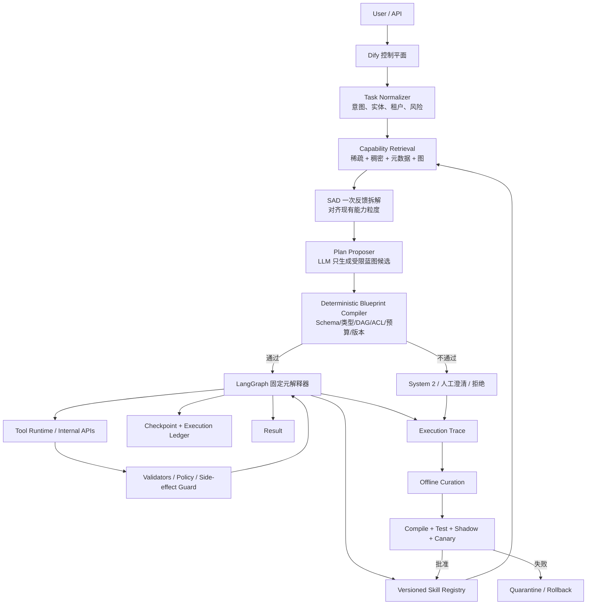
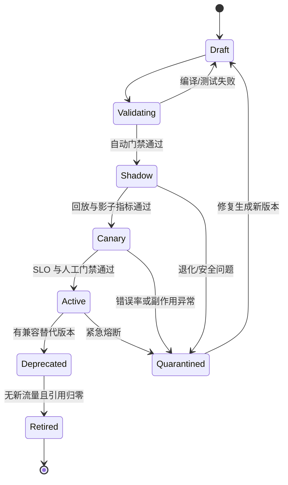

# diff_Fregment：Token Reduce 系统的可组合 FSM、技能治理与精确检索增量方案
> 核心结论：保留“Dify 控制平面 + LangGraph 可靠执行平面 + DAEF 宏观骨架 + 原子 FSM + System 1/System 2”的原架构，通过**版本化技能契约、固定元解释器、类型化蓝图编译、分层检索与发布门禁**补齐生产化缺口。

---

## 0. 先给结论：哪些保留，哪些增强，哪些必须修正

### 0.1 完整保留的主干

1. **双系统分工不变**：System 1 复用已验证的确定性执行资产；System 2 只处理未知、歧义和例外。
2. **Dify + LangGraph 的技术分工不变**：Dify 负责入口、任务理解、检索、策略选择和人工交互；LangGraph 微服务负责持久化、暂停/恢复、确定性执行与失败恢复。
3. **不再把端到端长 Workflow 当作最小经验单元**：继续采用 DAEF 宏观骨架与原子 FSM/FSM Shard。
4. **60/40 任务采用混合执行**：可复用部分走固定脚本，缺失部分走受控 System 2，并保留完整 Trace 供后续蒸馏。
5. **SAD 的“先粗拆、取技能线索、再对齐拆解”保留**，但从固定 Top-15 改为可校准参数。
6. **Umbrella-First、Patch、Merge、Revise、Retire、Human-in-the-Loop 保留**，但所有变更必须生成新版本，不能在线原地改写正在使用的技能。

### 0.2 本方案新增的工程层

1. **Skill Contract**：每个原子 FSM 都必须声明输入、前置条件、输出、效果、验证器、失败模式、权限、幂等与补偿。
2. **Blueprint Compiler**：LLM 只“提议”执行蓝图；确定性编译器负责 Schema、DAG、类型、权限、风险、版本和预算校验。未通过编译的蓝图绝不执行。
3. **固定元解释器**：线上不为每个请求临时生成并编译一张新的 LangGraph；LangGraph 运行一张稳定的解释器图，把 Blueprint 当数据执行。
4. **版本化 Registry + 可重建检索索引**：PostgreSQL 是事实源，向量/BM25 是可重建索引，不把 Dify 知识库或向量库当事务数据库。
5. **不可变发布与渐进交付**：Draft -> Validating -> Shadow -> Canary -> Active -> Deprecated/Quarantined -> Retired。
6. **可观测性与真实 Token 账本**：区分路由、参数抽取、System 2、Embedding 与执行器的成本，禁止用“整个链路 0 Token”作未经测量的承诺。

### 0.3 必须修正的原稿假设

| 原稿表述 | 工程问题 | 本方案修正 |
| --- | --- | --- |
| 运行时动态编译临时 LangGraph | 动态图版本、恢复、检查点命名空间和观测复杂；并非实现 60/40 的必要条件 | 固定 Meta-Executor + 数据化 Blueprint；已批准子图预注册/预编译 |
| 将 40% 未知部分当作一次参数提取 | 参数缺失与能力缺失是两类问题；未知业务动作不能靠抽取器完成 | 只有“值缺失”走 Extractor；“能力/逻辑缺失”必须走受控 Reason 节点或人工节点 |
| W 必须绝对线性，复杂判断全部塞进节点 | 会隐藏影响副作用、审批、补偿的业务分支，降低审计与恢复能力 | 本地实现细节留在节点内；业务显著分支、循环、审批和补偿显式留在图上 |
| 将 40% 新动作都作为 Attachment 注入旧 FSM | Attachment 是资源、约束和运行绑定，不应成为绕过图校验的任意代码入口 | 仅资源/配置可作为 Attachment；改变数据流或产生副作用的动作必须是显式 Blueprint Step |
| 相似度 >0.95 即 REUSE | 不同 Embedding、语料和任务下分数不可比；高语义相似不代表接口可执行 | 以“子目标覆盖 + 前置条件 + 类型兼容 + 验证器 + 风险门禁”决定模式，分数仅用于排序 |
| 3 个 LLM 生成留存用例，下降 1% 即回滚 | 样本过少且生成器与被测对象可能同源，统计结论无效 | 固定黄金集 + 生产回放 + 变形/属性测试 + 对抗集；按风险设最小样本、置信区间和人工门禁 |
| 低频或低分技能直接物理删除 | 可能仍被旧 Blueprint、审计记录或长任务引用 | 先下架/隔离，保留版本与别名；引用归零且满足保留期后才物理清理 |
| Checkpointer 保证“严格执行一次” | Checkpoint 只能恢复状态，无法自动消除外部 API 重试造成的重复副作用 | 外部副作用必须使用 idempotency key、执行账本、Outbox/去重或补偿动作 |

---

## 1. 三个问题的工程化定义与验收目标

### Q1：只有部分历史能力匹配时，怎样组合而不失控

问题不是“找到一个 60% 相似的 Workflow”，而是：

- 能否把任务表示为一组有前后状态的子目标；
- 是否存在一条由已验证技能构成、类型与前置条件都成立的路径；
- 未覆盖子目标是否能在权限和成本边界内由 System 2 完成；
- 组合后的整条链是否可验证、可恢复、可补偿、可审计。

**验收目标**：部分匹配任务能够输出一份版本固定、通过编译门禁的 Blueprint；已覆盖步骤不再逐步调用 LLM 决策，未知步骤不会伪装成“参数提取”。

### Q2：技能库增长后，怎样防膨胀、防退化并安全演进

问题不是简单地“定期让 LLM 合并文档”，而是把技能库当成一个长期运行的软件制品库：

- 重复技能、接口漂移、缺少验证器、失效依赖与错误修补能否被检测；
- 新技能/补丁能否通过独立测试、影子流量与 Canary 后再发布；
- 运行中的 Blueprint 是否始终引用不可变版本；
- 修复失败时能否在不污染 Active 版本的情况下回滚。

**验收目标**：任何新增、合并、修订、下架都有证据、版本、测试和审计记录；LLM 无权直接覆盖 Active 技能。

### Q3：粒度不一致时，怎样检索、重排并组成真正可执行的链

问题不是“向量库里有没有相似描述”，而是：

- 拆解粒度是否与现有技能的能力边界对齐；
- 召回结果是否同时满足语义、关键词、租户/权限、环境和版本约束；
- 候选技能的前置状态和完成状态能否连接；
- 是否存在必要的验证器、适配器或人工确认节点。

**验收目标**：召回、重排和组装分别可测；系统能区分“没召回”“粒度拆错”“接口不兼容”“计划不可执行”四种失败，而不是统一归因于向量相似度。

---

## 2. 证据基础：论文可借鉴什么，不能承诺什么

本方案采用“**论文提供结构化启发，成熟运行时提供工程能力，内部测试决定生产 SLA**”的证据原则。

| 来源 | 可直接借鉴的机制 | 证据边界 |
| --- | --- | --- |
| [Workflow-to-Skill / W2S](https://arxiv.org/abs/2606.06893) | Routing + Workflow + Semantics + Attachments；Trace 不是摘要材料，而是可执行规范证据 | 70 个技能上的回放一致性实验；不能证明企业 API 场景已生产化 |
| [SKILL-DISCO](https://arxiv.org/abs/2606.26669) | 将共享轨迹提炼为参数化 FSM/PFSM 子图，并在编译后验证 | 明确聚焦 FSM-defined、近确定性环境；不适用于任意开放式生成任务 |
| [SkillFlow](https://arxiv.org/abs/2604.17308) | DAEF、基于轨迹与 Rubric 的 Patch、长期演进失败模式 | 它首先是 benchmark/testbed，不是可直接部署的技能注册与执行框架；部分模型演进后反而退化 |
| [SkillOps](https://arxiv.org/abs/2605.13716) | P/O/A/V/F 契约、依赖/兼容/冗余/替代图、规则化维护 | 主要在 ALFWorld 与半合成库验证，部分实验依赖结构化或 gold 参数；需在本业务重测 |
| [Compositional Skill Routing](https://arxiv.org/abs/2606.18051) | Decompose-Retrieve-Compose、SAD 粒度反馈 | 30 条端到端 Pilot 使用 mock executors，错误恢复仍是待完善项；不能把 76.7% 当生产完成率 |
| [Task Decomposition-Guided Reranking](https://arxiv.org/abs/2607.06283) | 用任务中间状态和技能前/后置状态重排，动态选择技能数量 | 文本交互环境实验；Cross-Encoder 带来额外延迟，需离线/在线分层使用 |
| [Generative Skill Composition](https://arxiv.org/abs/2606.32025) | 联合预测技能子集、数量和顺序；小而正确的集合可能优于全量技能 | 需要任务-组合训练对；长技能链仍有少发问题，不应作为 MVP 前置依赖 |
| [SkillDroid](https://arxiv.org/abs/2604.14872) | 成功轨迹参数化、确定性重放、失败后回退/再编译 | 单应用移动 GUI 技能为主；论文明确把跨技能组合列为后续方向 |
| [COMFYCLAW](https://arxiv.org/abs/2607.01709) | 类型化图编辑、无效编辑回退、验证反馈进入技能演进 | 图像工作流特定领域；只借鉴“类型化编辑 + 验证后提交”原则 |
| [LangGraph Graph API](https://docs.langchain.com/oss/python/langgraph/graph-api)、[Persistence](https://docs.langchain.com/oss/python/langgraph/persistence)、[Subgraphs](https://docs.langchain.com/oss/python/langgraph/use-subgraphs) | 条件路由、Command、Checkpoint、Interrupt、子图持久化 | Checkpoint 提供故障恢复，不等同于外部副作用的 exactly-once |
| [Dify 官方项目](https://github.com/langgenius/dify) | Workflow、RAG、工具接入、权限与可观测入口 | 作为控制平面；不让其承担动态长任务的唯一状态事实源 |
| [pgvector 官方实现](https://github.com/pgvector/pgvector) | PostgreSQL 内向量检索，可与全文检索、RRF/Cross-Encoder 组合 | 向量索引只负责候选召回，不负责资产事务、版本和发布正确性 |

因此，本方案不会写“某篇论文证明了本系统能在生产节省 93% Token”或“某个研究框架直接保证长期可用”。所有工程效果必须通过第 10 节的内部基准验证。

---

## 3. 增量后的总体架构



### 3.1 控制平面与执行平面

**Dify 控制平面负责：**

- 用户入口、会话与业务上下文；
- Task Normalization、候选检索、REUSE/HYBRID/NEW 决策；
- System 2 节点和人工澄清；
- 调用 LangGraph 执行 API，并展示执行状态；
- 不持有 Active 技能唯一副本，不直接改写技能执行体。

**LangGraph 执行平面负责：**

- 对已通过编译的 Blueprint 进行确定性调度；
- 维护 `run_id/thread_id`、步骤状态、Checkpoint 与暂停/恢复；
- 调用版本固定的 FSM/Tool/Validator；
- 重试、超时、补偿、人工 Interrupt；
- 记录每个步骤的输入摘要、输出摘要、版本、成本与验证结果。

**Skill Registry/Governance 控制平面负责：**

- 技能、骨架、适配器、验证器和工具契约的版本管理；
- 发布状态、依赖图、租户 ACL、风险等级与证据链；
- 维护检索 Header 与执行 Body 的分离；
- 生成索引快照，保证一次规划使用同一个 `registry_snapshot_id`。

### 3.2 四类资产，不再混称为 Skill

| 资产 | 定义 | 是否直接执行 | 典型粒度 |
| --- | --- | --- | --- |
| Primitive Tool | 单个受控 API/函数能力 | 是 | 一次外部/内部操作 |
| FSM Shard | 围绕一个稳定业务子目标的参数化、可验证小状态图 | 是 | 1 个子目标，内部可含多个工具步骤 |
| Workflow Skeleton / DAEF | 不绑定具体工具的宏观状态/数据流骨架 | 否，只作为规划先验 | Information -> Transform -> Decision -> Action |
| Blueprint | 针对一次请求生成、引用固定版本资产的执行实例 | 由元解释器执行 | 当前任务所需的 DAG/受控循环 |

`Skill` 在本文中默认指可注册资产的上位概念；生产代码必须使用明确的 `kind`，不能靠名字猜测其运行语义。

---

## 4. 切分原则与统一 Skill Contract

### 4.1 FSM Shard 的切分边界

一个 FSM Shard 应同时满足以下条件：

1. **单一业务子目标**：能用一句可验证的完成状态描述，例如“已创建符合模板的 Jira 工单”，而不是“处理 IT 请求”。
2. **高内聚**：内部步骤共享同一数据对象、权限域和失败恢复策略。
3. **输入/输出可类型化**：输入与输出能写成 JSON Schema，关键结果可由 Validator 判断。
4. **失败局部可控**：重试、回退或补偿能够在该 Shard 内完成，或显式声明上抛。
5. **跨实例参数化**：人名、ID、日期、金额、URL、租户等都来自参数/Secret Ref，不含一次性 Filled Values。
6. **至少有重复证据或明确人工设计依据**：单次成功轨迹默认只是 Candidate，不足以自动晋升为 Active FSM。

优先在以下位置切边界：

- 数据 Schema/Artifact 类型发生变化；
- 权限域或租户发生变化；
- 进入不可逆副作用前；
- 验证/审批责任发生变化；
- 重试和补偿策略发生变化；
- 一个可独立复用的业务完成状态形成。

不要在以下位置强行切分：

- 同一事务中不能独立提交的连续步骤；
- 仅仅因为 Trace 中产生了新的日志行；
- HTTP 连接、发送请求、解析响应等已被一个稳定工具封装的内部细节；
- 无法单独定义完成条件的过细动作。

### 4.2 W/S/A 的正确落位

- **Workflow (W)**：保留业务显著的顺序、并行、分支、循环、审批和补偿边。
- **Semantics (S)**：节点目标、前置/后置条件、本地重试、接受/拒绝准则。
- **Attachments (A)**：工具绑定、参考资料、模板、配置、Secret Ref、权限和输出约束。

判断规则：如果一个变化会改变**哪个动作被执行、执行顺序或外部副作用**，它属于 W/S 或显式 Blueprint Step；如果只改变**运行所需资源或配置绑定**，才属于 A。

### 4.3 Skill Contract 最小 Schema

下面的 JSON 是注册表的逻辑结构；生产实现应使用 [JSON Schema Draft 2020-12](https://json-schema.org/draft/2020-12) 校验，并把大执行体/测试制品放到对象存储或 Git 制品库中。

```json
{
  "schema_version": "1.0",
  "skill_id": "fsm.jira.create_ticket",
  "version": "1.3.0",
  "kind": "fsm_shard",
  "status": "ACTIVE",
  "routing": {
    "summary": "根据结构化故障信息创建 Jira 工单",
    "intents": ["create_it_ticket"],
    "positive_examples": ["为服务器故障创建 Jira 工单"],
    "anti_triggers": ["仅查询已有工单状态"]
  },
  "contract": {
    "input_schema_ref": "schema://jira/create-ticket-input/2",
    "preconditions": ["ctx.tenant_id != null", "input.summary != ''"],
    "output_schema_ref": "schema://jira/ticket/1",
    "effects": [
      {
        "resource": "jira.ticket",
        "operation": "create",
        "side_effect": "non_idempotent"
      }
    ],
    "validators": ["validator.jira.ticket_exists@1.1.0"],
    "known_failure_modes": ["AUTH_EXPIRED", "RATE_LIMITED", "INVALID_PROJECT"]
  },
  "runtime": {
    "executor_ref": "langgraph://jira/create-ticket/1.3.0",
    "tool_refs": ["tool.jira.create@3.2.1"],
    "timeout_seconds": 60,
    "retry_policy_ref": "retry://external-write-safe/1",
    "idempotency": {
      "required": true,
      "key_template": "${run_id}:${step_id}"
    },
    "compensation_ref": "fsm.jira.cancel_ticket@1.0.0"
  },
  "security": {
    "risk_level": "MEDIUM",
    "required_scopes": ["jira:ticket:create"],
    "data_classes": ["INTERNAL"],
    "allowed_tenants": ["tenant-a"]
  },
  "governance": {
    "provenance_trace_ids": ["trace-01", "trace-02"],
    "owner": "it-automation",
    "created_by": "human-reviewed-distiller",
    "test_suite_ref": "tests://fsm.jira.create_ticket/1.3.0",
    "artifact_digest": "sha256:..."
  }
}
```

约束表达式建议使用受限的 CEL/JSONLogic 子集；参数映射建议使用 JSON Pointer/JSONPath 白名单。**不要对用户输入执行任意 Jinja/Python 表达式**。

### 4.4 DAEF Skeleton Schema

DAEF 只保存抽象阶段与状态契约，不保存具体工具名：

```json
{
  "skeleton_id": "daef.inspect_write_notify",
  "version": "1.1.0",
  "stages": [
    {"id": "inspect", "goal": "获得经过验证的结构化事实"},
    {"id": "write", "goal": "将事实写入目标业务系统"},
    {"id": "notify", "goal": "将结果通知授权接收方"}
  ],
  "edges": [
    {"from": "inspect", "to": "write"},
    {"from": "write", "to": "notify"}
  ],
  "required_invariants": ["write 之前事实必须通过 schema validator"]
}
```

DAEF 是规划先验，不是强制模板。如果当前任务与骨架冲突，以任务约束和 Skill Contract 为准。

### 4.5 Blueprint Schema

```json
{
  "blueprint_id": "bp-20260714-001",
  "schema_version": "1.0",
  "registry_snapshot_id": "snapshot-8831",
  "mode": "HYBRID",
  "budgets": {
    "max_steps": 12,
    "max_reason_steps": 1,
    "max_llm_calls": 2,
    "deadline_seconds": 300
  },
  "steps": [
    {
      "step_id": "extract_error",
      "type": "reason",
      "goal": "从授权日志源获得结构化错误信息",
      "allowed_tool_refs": ["tool.log.read@2.0.0"],
      "output_schema_ref": "schema://it/error-fact/1",
      "validator_refs": ["validator.it.error_fact@1.0.0"]
    },
    {
      "step_id": "create_ticket",
      "type": "fsm",
      "asset_ref": "fsm.jira.create_ticket@1.3.0",
      "depends_on": ["extract_error"],
      "input_bindings": {
        "summary": "/steps/extract_error/output/summary",
        "details": "/steps/extract_error/output/details"
      }
    },
    {
      "step_id": "notify",
      "type": "fsm",
      "asset_ref": "fsm.wecom.notify@2.1.0",
      "depends_on": ["create_ticket"],
      "input_bindings": {
        "ticket_url": "/steps/create_ticket/output/url"
      }
    }
  ]
}
```

允许的 Step 类型固定为：`fsm`、`tool`、`extract`、`reason`、`adapter`、`validator`、`human`。新增类型需要升级 Blueprint Schema，不能由 LLM 自由发明。

---

## 5. Q1 完整方案：60/40 的可组合执行

### 5.1 路由模式从三档相似度改为三类可执行性

| 模式 | 判定条件 | LLM 参与方式 |
| --- | --- | --- |
| REUSE | 所有必需子目标由 Active 固定版本资产覆盖；类型、前置条件、权限、验证器和预算全部通过 | 路由可用 0-1 次轻量模型；执行步骤不需要 LLM 决策 |
| HYBRID | 部分子目标被覆盖；未覆盖部分可在受控工具、风险和预算范围内执行 | 仅未知 Step 调用 System 2/Extractor；复用 Step 保持确定性 |
| NEW | 无可靠覆盖、蓝图无法编译、关键输入歧义、风险过高或缺少权限 | 完整 System 2，必要时人工确认；成功也只生成 Candidate |

`REFERENCE` 保留为 UI/兼容名称时，应映射到 `HYBRID`，不能把整篇历史 Workflow 注入 Prompt 后继续无限 Agent Loop。

### 5.2 运行时流程

1. **Normalize**：提取租户、身份、时间基准、业务实体、数据级别、风险等级；缺失关键身份信息直接澄清。
2. **粗拆任务状态**：得到最少数量的高层子目标与期望中间状态，不拆到 HTTP 内部动作。
3. **硬过滤**：先按租户、ACL、状态、环境、工具可用性、风险、Schema 版本过滤技能。
4. **混合召回**：稀疏、稠密、元数据和 Capability Graph 分别召回。
5. **SAD 一次对齐**：只给模型候选 Header 与 Contract 摘要，重新调整子目标粒度。
6. **蓝图提议**：LLM 只能从候选 ID、允许的 Step 类型与版本快照中选择，输出结构化 JSON。
7. **确定性编译**：执行第 5.3 节的硬门禁。最多允许一次带错误码的修复提议；仍失败则转 NEW/人工。
8. **固定元解释器执行**：根据依赖选择 Ready Step，执行、验证、写账本，再推进下一步。
9. **失败分流**：可重试错误走策略；业务拒绝走显式分支；不可逆步骤失败走补偿/人工；禁止静默让 LLM 改图后继续。
10. **Trace 入库**：保存结构化事件，不默认保存完整思维链；敏感输入脱敏或仅存引用。

### 5.3 Blueprint Compiler 的硬门禁

编译器必须是普通代码，不由 LLM 自评：

- Blueprint JSON Schema 合法；
- `registry_snapshot_id` 存在，所有 `asset_ref` 为 Active/Canary 可见版本；
- Step ID 唯一、依赖存在、DAG 无环；受控循环只能使用显式 `max_iterations`；
- 上游 Output Schema 与下游 Input Schema 兼容；
- Adapter 必须引用已注册版本，不能生成临时代码绕过类型错误；
- 每个外部写操作声明幂等策略或补偿策略；
- 所需权限是当前用户/服务身份权限的子集；
- 高风险动作存在 Human/Policy Gate；
- 所有必需子目标被 `fsm/tool/reason/human` 中某一种显式覆盖；
- Step、LLM、时间、金额/调用成本预算未超限；
- 工具/技能版本不存在已知 Blocker；
- 输入绑定仅能读取允许的 JSON Pointer，不能访问 Secret 实值或其他租户状态。

### 5.4 LangGraph 固定元解释器

推荐的父图是稳定的循环，而不是每次重建图：

```text
START
  -> validate_blueprint
  -> select_ready_steps
  -> dispatch_step
       -> registered_fsm_executor
       -> registered_tool_executor
       -> structured_extractor
       -> bounded_reason_node
       -> human_interrupt
  -> validate_step_output
  -> persist_ledger
  -> select_ready_steps
  -> finalize_or_compensate
  -> END
```

实现要点：

- 父图状态只保存小型控制数据、Artifact 引用和摘要；大文件放对象存储，避免 Checkpoint 膨胀。
- 每次运行使用唯一 `thread_id=run_id`；子执行器使用 `run_id:step_id:attempt`，避免并发命名空间冲突。
- 已有 LangGraph 子图可以注册为一个 `fsm` Executor；普通线性 FSM 可以由解释器直接执行数据化指令。
- 运行中的 Blueprint 始终固定版本。即使 Registry 发布新版本，本次运行也不热切换。
- Checkpoint 只保证从已保存状态恢复。外部写操作必须先查 Execution Ledger/Idempotency Key，再决定是否重放。

### 5.5 40% 未知部分的三分法

| 未知类型 | 示例 | 正确处理 |
| --- | --- | --- |
| Value Gap | 用户说“明天下午”，缺少 ISO 时间 | `extract`：规则/NER 优先，结构化 LLM 兜底，Schema 校验；仍歧义则询问 |
| Adapter Gap | 上游输出 `ticket_url`，下游要求 `message.text` | 只调用已注册、已测试的 Adapter；不存在时转 System 2 Candidate，不能线上生成任意代码 |
| Capability/Logic Gap | 需要从一个新日志系统读取并判断故障 | `reason`：受限工具集合、最大步数、输出 Schema、Validator、权限与审计；高风险则人工 |

相对时间必须带 `locale/timezone/now`；金额、审批人、收件人、删除范围等高风险参数不得静默猜测。

### 5.6 60/40 示例的正确执行

任务：“提取服务器 A 的底层错误码，然后按标准格式创建 Jira 工单，最后发企业微信通知。”

- `create_ticket` 和 `wecom_notify` 已有 Active FSM，属于确定性复用部分；
- 新日志系统没有技能，属于 Capability Gap；
- Dify 生成 HYBRID 蓝图：一个受限 `reason` Step + 两个固定版本 FSM；
- 编译器验证日志读取权限、Reason 输出 Schema、Jira 输入兼容、通知接收人范围和幂等策略；
- LangGraph 只在第一步调用 System 2；后两步不再逐步询问 LLM；
- 若第一步反复成功并积累足够多独立 Trace，离线蒸馏为 Candidate FSM，测试通过后再进入 Active。

这里的 Token 表述应为：**两个复用 FSM 的执行决策为 0 LLM Token；整条请求仍可能包含路由、SAD、参数抽取或 Reason Token。**

---

## 6. Q2 完整方案：长期治理与安全演进

### 6.1 资产生命周期



关键原则：

- Active 制品不可变；Patch 永远产生新版本。
- 运行中 Blueprint 固定 `skill_id@version` 与 `artifact_digest`。
- Quarantine 立即阻止新规划，但允许按策略完成/中止已运行实例。
- Deprecated 保留兼容窗口；Retired 保留审计与回放所需元数据。
- 物理删除必须满足保留期、法规、审计和“无 Blueprint/Trace 引用”。

### 6.2 Candidate 的入库证据

成功一次不等于可复用。Candidate 至少包含：

- 结构化 Trace ID 与环境/工具版本；
- 对应的任务族、输入 Schema 与完成 Validator；
- 成功与失败样本，而非只看成功轨迹；
- W/S/A 或 PFSM 的来源证据；
- 被抽象掉的 Filled Values 清单；
- 风险等级、权限范围、数据分类；
- 初始测试集和预期失败模式；
- 生成模型/提示版本与人工编辑记录。

开放式创作、一次性分析和不可验证任务默认不蒸馏为 FSM，只能沉淀为参考知识或策略说明。

### 6.3 Patch Protocol：类型化、可并发控制、可回滚

Patch Proposal 必须包含：

```json
{
  "target": "fsm.jira.create_ticket@1.3.0",
  "base_version": "1.3.0",
  "patch_type": "ATTACHMENT",
  "operations": [],
  "evidence_trace_ids": [],
  "new_tests": [],
  "expected_metric_change": {},
  "author": "curation-agent-v2"
}
```

Patch 类型限定为：

- `WORKFLOW`：节点、边、显式分支/循环/补偿改变；
- `SEMANTICS`：前置/后置、Predicate、局部重试、完成条件改变；
- `ATTACHMENT`：工具版本、配置、模板、资源、Secret Ref 改变；
- `CONTRACT`：输入/输出 Schema、权限、风险或数据分类改变；
- `TEST_ONLY`：只补充测试与验证器。

并发保护：

- 以 `base_version`/ETag 做乐观锁；如果目标已经升级，Patch 必须重新 Rebase 和全量测试；
- 同一 `skill_id` 同时只允许一个发布事务进入 Canary；
- Patch Agent 没有直接写 Active 表的权限，只能创建 Draft；
- 生成 Patch 的模型不能单独担任最终 Judge，高风险变更必须人工审批。

### 6.4 Umbrella-First 的可执行判定

新增 Candidate 时依次执行：

1. **精确重复**：规范化执行图/AST、Contract 和 Artifact Digest 相同，直接拒绝新增并关联证据。
2. **参数化重复**：W、输入输出和效果相同，仅常量不同，扩展现有参数/枚举并生成新版本。
3. **替代实现**：目标与 Contract 相同，但工具、成本、地区或可靠性不同，保留为 `alternative`，不要强行合并。
4. **组合关系**：Candidate 实际是多个现有技能的固定组合，只新增 Skeleton/组合模板，不复制执行体。
5. **全新能力**：具有新的可验证效果或新的必要控制结构，才创建新 `skill_id`。

合并前必须检查权限域、数据分类、失败模式和副作用语义。两个描述相似但安全边界不同的技能不能合并。

### 6.5 健康分数不能只用 success_rate

对每个技能按任务族、租户、工具版本和风险分层统计：

- 调用数、成功数、验证失败数、超时数、补偿数；
- 路由命中后实际采用率；
- 误路由率与蓝图编译失败率；
- P50/P95 延迟、LLM Token、总成本；
- 最近一次成功/验证/依赖更新；
- 依赖脆弱度、无 Validator 比例、Schema 漂移；
- 用户/人工纠正率。

排序使用保守置信下界，而不是小样本 100% 成功率。可采用 Beta-Binomial 后验下界或 Wilson Lower Bound，并引入适度时效衰减。时效衰减用于**降权和触发复测**，不直接触发删除。

链路可靠度不能只取单技能平均值。可先用各 Step 可靠度下界的乘积作为保守近似，再结合共享依赖和补偿能力校正。链越长，越要减少不必要技能。

### 6.6 验证金字塔与发布门禁

从低成本到高成本依次执行：

1. **静态检查**：Schema、引用、循环上限、Secret、权限、危险工具、硬编码 Filled Values。
2. **Contract 单测**：合法/非法输入、前置条件、Output Schema、Validator、已知失败模式。
3. **模拟/沙箱集成测试**：固定 API Stub、超时、429、5xx、部分成功、重复回调。
4. **黄金回放集**：人工维护的代表性任务与关键边界。
5. **生产 Trace 脱敏回放**：覆盖近期真实分布和失败样本。
6. **变形/属性测试**：同义改写、参数范围、顺序不变量、幂等重放、日期/时区、空值。
7. **对抗与安全测试**：Prompt Injection、越权租户、Secret 泄漏、恶意 URL、数据外传。
8. **Shadow**：生成计划和结果但不产生真实副作用，或与 Active 并行对比。
9. **Canary**：低风险小流量；写操作使用隔离租户/审批/双写保护。

发布比较至少观察：任务成功、Validator 通过、严重错误、人工纠正、Token/成本和延迟。任何安全/越权失败都是硬阻断，不与平均收益做加权抵消。

### 6.7 自动修复的边界

允许自动进入 Canary 的低风险变更：

- 文档/Header 改进；
- 无语义变化的工具补丁版本升级；
- 新增 Validator 或测试；
- 明确的字段 Rename Adapter，且契约与回放全部通过。

必须人工审批：

- 新增/扩大写、删、支付、审批、通知范围；
- 权限、租户、数据分类变化；
- 补偿逻辑改变；
- Contract Breaking Change；
- 训练/测试证据不足但计划上线；
- 合并导致多个旧技能被替代。

### 6.8 防污染与供应链安全

- Skill Artifact 使用 Digest/签名，执行时复核；
- 工具和附件使用 allowlist，Secret 只存 Secret Ref；
- Skill 生成和测试在隔离环境运行；
- 禁止技能正文覆盖平台级安全策略；
- Registry 查询强制带 `tenant_id` 和 ACL，不能只靠向量过滤后再授权；
- Trace 默认不存完整 Chain-of-Thought，只存动作、结构化理由码、输入输出摘要、Validator 和错误；
- 新来源论文、GitHub 代码或用户上传附件只能进入 Draft，不能自动成为可执行附件。

---

## 7. Q3 完整方案：存储、检索、拆解、重排与组装

### 7.1 存储原则

推荐 MVP 使用 **PostgreSQL + JSONB + pgvector + PostgreSQL Full Text Search**；数据量、语言分词或检索吞吐超出能力后，再将 OpenSearch/Qdrant/Milvus 作为派生索引。PostgreSQL 始终是事实源。

理由：

- 技能版本、状态、依赖边和发布事务需要强一致；
- JSONB 适合保存 Contract/Blueprint 元数据；
- pgvector 与全文检索可先满足混合检索，并使用 RRF 合并；
- 索引可以从 Registry Snapshot 重建，避免向量库损坏即资产丢失。

### 7.2 最小数据表

| 表 | 关键字段 | 作用 |
| --- | --- | --- |
| `skill` | `skill_id`, `kind`, `owner`, `tenant_scope` | 稳定身份 |
| `skill_version` | `skill_id`, `version`, `status`, `contract_json`, `artifact_uri`, `digest` | 不可变版本 |
| `skill_route_header` | `summary`, `examples`, `anti_triggers`, `embedding`, `tsvector` | 第一阶段轻量检索 |
| `skill_edge` | `from_ref`, `to_ref`, `edge_type`, `adapter_ref`, `confidence` | dependency/compatibility/redundancy/alternative/version |
| `skeleton_version` | `skeleton_id`, `version`, `stages_json` | DAEF 骨架 |
| `validator_version` | `validator_id`, `version`, `schema`, `executor_ref` | 完成判断 |
| `blueprint` | `blueprint_id`, `snapshot_id`, `mode`, `body`, `compile_result` | 运行计划与编译证据 |
| `execution_run` | `run_id`, `thread_id`, `blueprint_id`, `status`, `token_cost` | 运行级账本 |
| `execution_step` | `run_id`, `step_id`, `attempt`, `asset_ref`, `idempotency_key`, `status` | 步骤与去重账本 |
| `evaluation_run` | `asset_ref`, `suite_ref`, `metrics`, `verdict` | 发布证据 |
| `patch_proposal` | `base_version`, `patch_type`, `evidence`, `status` | 治理审计 |
| `registry_snapshot` | `snapshot_id`, `created_at`, `active_set_digest` | 一次规划的一致视图 |

执行日志、Artifact 大对象和测试报告可放对象存储，但数据库保留 URI、Digest、租户和生命周期。

### 7.3 两阶段披露，不是只检索一句 Description

**Stage A - Header Retrieval**：只载入几十到数百 Token 的 Header：

- 名称、一句话能力、输入/输出类型摘要；
- 前置/完成状态摘要；
- 风险、租户、版本状态；
- Positive/Negative Trigger；
- 可靠度下界和近期验证时间。

**Stage B - Contract Reranking**：只对 Top-N 读取完整 Contract/必要片段，不把执行代码塞进 Dify Prompt。确定选中后，LangGraph 才按 `asset_ref` 加载执行体。

这比“只看 F 字段然后直接执行”更安全：一句描述适合粗召回，但最终可执行性必须看前置条件、效果、Schema、Validator 和权限。

### 7.4 检索链路

1. **访问控制过滤**：`tenant/status/environment/risk/tool availability/schema version`。
2. **Sparse**：名称、工具、业务实体、错误码、精确术语；中文需配置合适分词或外部检索引擎。
3. **Dense**：任务语义、子目标、前置/完成状态。
4. **Graph Expansion**：从高相关技能扩一跳 dependency/alternative/required-validator，禁止无界扩图。
5. **RRF 合并**：优先用 Reciprocal Rank Fusion 合并不同排名，避免直接相加不可比的 BM25 与 Cosine 原始分数。
6. **SAD Hinting**：将候选 Header 作为能力词表，重新拆解一次。
7. **Per-subtask Retrieval**：对修正后的每个子目标分别召回。
8. **Rerank**：用 Cross-Encoder 或小型结构化模型评估 Goal、Precondition、Effect、Schema、Risk；Top-N 和模型通过离线集调优。
9. **Compose**：LLM 提议最短可行技能链，编译器做确定性验证；必要时插入已注册 Adapter/Validator/Human。

`Top-10`、`Top-15`、`score > 0.8` 只能作为初始配置，必须通过真实任务集选择。库增长后按召回率、延迟和 Token 预算动态调整。

### 7.5 SAD 的生产实现

Pass 1 输出：

```json
{
  "subgoals": [
    {"goal": "获得服务器错误事实", "expected_state": "错误信息已结构化并验证"},
    {"goal": "创建工单", "expected_state": "工单已创建"},
    {"goal": "发送通知", "expected_state": "授权接收方已收到结果"}
  ]
}
```

Hint Retrieval 返回 Header，不返回完整技能正文。Pass 2 必须遵守：

- 使用最少的有意义子目标；
- 一个子目标可以由一个 FSM Shard 完成时，不拆其内部实现；
- 不得为了匹配候选而删除用户明确要求；
- 若候选能力只能覆盖部分目标，保留 `uncovered=true`；
- 输出前置状态和完成状态，供后续 Contract 对齐。

默认只做一次反馈。第二次仍无法对齐时转 System 2，不进行无界“拆解-检索”循环。

### 7.6 从相似度阈值改为 Plan Coverage

对每个子目标 `g_i` 计算：

```text
coverage_i = semantic_match
             * precondition_satisfied
             * effect_match
             * schema_compatible
             * policy_allowed
             * reliability_lower_bound
```

其中后四项存在硬失败时 `coverage_i=0`。总体覆盖按子目标业务权重汇总，但模式选择还要执行硬门禁：

- 全部必需子目标有可验证路径，才能 REUSE；
- 部分覆盖且未知部分风险/预算可控，才 HYBRID；
- 任一关键目标无路径、越权、缺少 Validator 或蓝图不可编译，则 NEW/澄清/拒绝。

阈值必须在标注集上按任务族校准，记录 Precision/Recall、误复用成本和置信区间。Embedding 分数只用于候选排序，不能单独触发副作用。

### 7.7 组合器的最小可行实现

MVP 不需要先训练 SkillComposer：

1. LLM 在候选 ID 白名单中生成 1-3 份受限 Blueprint；
2. 编译器逐份验证；
3. 对可执行候选按风险、预计成功下界、步骤数、成本排序；
4. 选择最短、风险最低的计划；
5. 没有候选通过则回退。

当积累足够多 `(task, accepted_blueprint)` 后，再训练/微调受约束的序列组合器。这样把 [Generative Skill Composition](https://arxiv.org/abs/2606.32025) 作为后续优化，而不是 PoC 阻塞项。

---

## 8. Dify 与 LangGraph 的接口和执行语义

### 8.1 推荐 API

```text
POST /v1/plans/compile
  input: task_context, candidate_blueprint, registry_snapshot_id
  output: compiled_blueprint | structured_compile_errors

POST /v1/runs
  input: compiled_blueprint_id, initial_inputs, caller_identity, idempotency_key
  output: run_id, status

GET /v1/runs/{run_id}
  output: status, current_steps, safe_result_summary, interrupts

POST /v1/runs/{run_id}/resume
  input: interrupt_id, human_input/approval, idempotency_key

POST /v1/runs/{run_id}/cancel
  input: reason, compensation_policy
```

Dify 只提交编译后的 Blueprint ID；生产环境不允许 Dify 直接向 `/runs` 发送未经编译的任意 JSON。

### 8.2 步骤状态机

```text
PENDING -> READY -> RUNNING -> SUCCEEDED
                         |-> RETRY_WAIT -> RUNNING
                         |-> WAITING_HUMAN -> RUNNING/CANCELLED
                         |-> FAILED -> COMPENSATING -> COMPENSATED/ESCALATED
```

每次状态转移写入 `execution_step` 和事件日志，并携带 `run_id/step_id/attempt/asset_ref/trace_id`。

### 8.3 重试、幂等和补偿

- 只对明确分类的瞬时错误自动重试；业务拒绝、权限错误和 Schema 错误不盲重试。
- Read/纯计算步骤通常可重试；Write 步骤必须有服务端 Idempotency Key 或本地去重账本。
- “请求超时但服务端可能已成功”时先调用查询/Validator 确认，不能直接重放创建操作。
- 多步骤业务事务使用 Saga/补偿；补偿本身也要版本化、幂等并可失败上报。
- Checkpoint 写成功与外部副作用成功之间仍可能有间隙；用 Execution Ledger + Outbox/回查缩小不一致窗口。

### 8.4 并行执行

只有同时满足以下条件的 Ready Step 才能并行：

- 没有数据依赖；
- 不写同一资源或已定义冲突控制；
- 权限和并发配额允许；
- 失败后可以独立重试/补偿；
- 合并输出有确定性 Reducer。

PoC 优先顺序执行；并行是性能优化，不应成为第一阶段正确性的前提。

### 8.5 统一错误分类与回退动作

| 错误码 | 含义 | 默认动作 |
| --- | --- | --- |
| `PLAN_SCHEMA_INVALID` | Blueprint 结构非法 | 拒绝执行；允许 Plan Proposer 修复一次 |
| `ASSET_NOT_AVAILABLE` | 版本不存在、不可见或已隔离 | 重新规划到可见版本；无替代则 NEW/人工 |
| `PRECONDITION_FAILED` | 当前状态不满足技能前置条件 | 查找前置技能或澄清输入，禁止强行调用 |
| `TYPE_MISMATCH` | 上下游 Artifact Schema 不兼容 | 使用已注册 Adapter；否则编译失败 |
| `POLICY_DENIED` | ACL、风险、租户或数据策略拒绝 | 硬拒绝并审计，不交给 LLM 绕过 |
| `INPUT_AMBIGUOUS` | 必需参数存在业务歧义 | Human Interrupt/澄清，不静默猜测 |
| `TRANSIENT_TOOL_ERROR` | 超时、限流、可恢复 5xx | 按 Retry Policy 退避；写操作先查幂等账本 |
| `SIDE_EFFECT_UNKNOWN` | 超时后无法确认写操作是否成功 | 先调用查询 Validator；无法确认则人工处理 |
| `OUTPUT_VALIDATION_FAILED` | 工具返回成功但结果不满足契约 | 进入显式修复/补偿，不标记成功 |
| `BUDGET_EXCEEDED` | 步数、LLM、时间或成本超限 | 暂停/终止并返回结构化原因 |
| `COMPENSATION_FAILED` | 回滚/补偿本身失败 | 立即升级人工，保留原始与补偿 Trace |

---

## 9. 对 `Token Reduce_Plan.md` 的逐项兼容性审阅

| 现有设计 | 结论 | 增量修订 |
| --- | --- | --- |
| Dify 作为统一入口、RAG、工具与编排平台 | 保留 | 定位为控制平面；Registry 与执行账本独立持久化 |
| LangGraph 作为经验执行器 | 保留并强化 | 使用固定元解释器、版本化 Executor、Checkpoint、Interrupt 和步骤账本 |
| 经验库每条经验是一份文档 | 需要升级 | 文档 Header 只用于检索；Contract、Version、Graph、Test、Artifact 分表/分制品保存 |
| REUSE/REFERENCE/NEW | 保留语义 | 工程枚举改为 REUSE/HYBRID/NEW；REFERENCE 映射 HYBRID |
| 高/中/低相似度阈值 | 不作为生产判定 | 改为 Plan Coverage + Compiler Hard Gates；相似度只排序 |
| 成功任务自动沉淀 | 需要门禁 | 自动生成 Candidate；验证、Shadow、Canary 后才能 Active |
| 通用经验执行器动态构图 | 思想保留，实现调整 | Blueprint 当数据，由固定图解释；复杂子图预注册，不为每次请求临时编译 |
| Jinja2 参数模板 | 限制使用 | 改用受限 JSON Pointer/类型绑定；禁止任意表达式与代码注入 |
| 一次性参数提取器 | 保留 | 规则/NER 优先，结构化 LLM 兜底，Schema/业务规则校验，歧义转人工 |
| Checkpointer 崩溃恢复 | 保留 | 明确不保证外部 API exactly-once；补充幂等、账本、回查、补偿 |
| 自动去重、合并、失效监控 | 保留并工程化 | Contract/Graph/Digest 判重，Patch 新版本，统计下界，先隔离/下架再清理 |
| 人工工坊 | 保留 | 聚焦高频 HYBRID、低置信 Active、高风险 Patch 与长期 Quarantine |
| 复用链路 0 Token | 修正文案 | “已路由的确定性执行步骤 0 LLM Token”；整条链仍统计路由/Embedding/抽取/Reason |
| 示例节省 93% | 仅作假设 | 以同任务基线 A/B 测试报告 P50/P95 Token、成本、成功率和延迟 |

### 9.1 Token 账本口径

每个 Run 至少记录：

```text
router_input_tokens / router_output_tokens
decompose_tokens / sad_tokens / rerank_tokens
extractor_tokens / reason_tokens / finalizer_tokens
embedding_input_units
llm_call_count
deterministic_step_count / reused_step_count
tool_call_count
total_model_cost / total_tool_cost
latency_p50_component_breakdown
```

跨 Dify、LangGraph、Registry 与 Tool Runtime 的 Trace、Metric、Log 应统一携带 `trace_id/run_id/step_id`，建议按 [OpenTelemetry](https://opentelemetry.io/docs/concepts/signals/) 的信号与上下文传播方式接入，避免每个组件维护无法关联的独立日志。

核心 KPI：

- `reuse_execution_ratio = reused_deterministic_steps / all_steps`
- `reasoning_avoidance_rate = 1 - actual_reason_llm_calls / baseline_reason_llm_calls`
- `validated_task_success_rate`
- `cost_per_validated_success`
- `false_reuse_rate`：被判 REUSE/HYBRID 但因技能不适用失败的比例
- `compile_rejection_rate`：及时阻止错误蓝图是正向安全指标，不能简单追求为零

优化目标是降低“每次**验证成功**的成本”，不能只压 Token 而牺牲任务成功、权限和副作用正确性。

---

## 10. 分阶段落地路线与验收门槛

### Phase 0：契约、账本与基准先行（1-2 周）

交付：

- 选 20-50 个高频、可验证任务作为 Golden Set；
- 定义 Skill Contract、Blueprint、错误码和 Trace Schema；
- 建立 `execution_run/execution_step` Token 与副作用账本；
- 为 5-10 个现有稳定工具补充输入输出 Schema、Validator、权限和幂等策略；
- 记录旧 Agent 基线。

退出条件：

- Golden Set 可重复运行；
- Token、成功、延迟和工具副作用可被统一追踪；
- 所有写工具都有幂等/回查/补偿三者之一。

### Phase 1：固定元解释器 + 纯 REUSE（2-4 周）

交付：

- PostgreSQL Registry MVP；
- 固定 LangGraph Meta-Executor；
- Blueprint Compiler V1；
- 5-10 个手工审阅的 Active FSM；
- Dify -> Compile -> Run -> Status/Resume 集成。

范围：只支持线性/小 DAG、固定版本、无在线自动修复。

退出条件：

- 重启后可从 Checkpoint 恢复；
- 重复提交同一 Idempotency Key 不产生重复副作用；
- 非法 Schema、越权、环路、类型错配蓝图 100% 被编译器拒绝；
- REUSE 任务成功率不低于旧 Agent 基线，执行阶段 LLM 调用显著下降。

### Phase 2：混合检索 + SAD + HYBRID（3-5 周）

交付：

- Header/Body 两阶段披露；
- Sparse + Dense + RRF；
- 一次 SAD；
- Contract Rerank；
- `extract` 与受限 `reason` Step；
- 失败分类与回退。

退出条件：

- 标注集上分别报告 Recall@K、Rerank Top-1、拆解准确率、Blueprint Compile Pass Rate；
- HYBRID 未知 Step 不得获得候选之外的工具权限；
- False Reuse 低于团队设定的风险阈值；
- 相比旧 REFERENCE 分支，单位成功任务 Token/成本下降且成功率不退化。

### Phase 3：Trace 蒸馏与治理工作台（4-6 周）

交付：

- Candidate 生成、W/S/A/PFSM 证据；
- Duplicate/Alternative/Composition 分类；
- Patch Proposal + 乐观锁；
- Golden/Replay/Property/Security Test；
- Shadow/Canary/Quarantine/Rollback；
- 人工审批页面。

退出条件：

- 自动生成物无法绕过 Draft；
- 任意版本可追溯到证据、测试、作者和 Digest；
- Canary 失败能自动停止新流量并回到上一 Active 版本；
- 旧 Blueprint 仍能解析其固定版本或得到明确迁移错误。

### Phase 4：规模化优化（持续）

可选项：

- Cross-Encoder/专用 Reranker；
- 基于历史 Accepted Blueprint 的 SkillComposer；
- 更强 Capability Graph 搜索；
- 自动 Adapter 提议但仍需测试门禁；
- 多租户索引分片、缓存和并行 Ready Step；
- 规则/NER 替代高频参数抽取 LLM。

这些都不是 Phase 1-2 的正确性前提。

---

## 11. 必测场景与冲突审阅结果

### 11.1 端到端必测场景

1. 100% 已覆盖，所有参数来自结构化上下文。
2. 100% 已覆盖，但一个必需参数歧义，需要 Human Interrupt。
3. 60/40：一个 Capability Gap + 两个已验证 FSM。
4. 过度拆解：一个 HTTP Fetch 被拆成连接/请求/写盘，SAD 应合并。
5. 欠拆解：下载并解析被错误合成一个步骤，SAD 应拆开。
6. 候选描述相似但前置条件不同，Contract Rerank 应选正确技能。
7. Output/Input 类型不兼容，无 Adapter 时编译失败。
8. Blueprint 有环、超预算、越权或引用 Deprecated/Quarantined 版本。
9. 外部创建 API 超时但实际成功，恢复时不得重复创建。
10. LangGraph 在写操作前后分别崩溃，检查恢复与账本行为。
11. Active 技能运行中发布新版本，本次 Run 仍使用旧固定版本。
12. Patch 与另一个发布并发，旧 `base_version` 必须冲突失败。
13. 合并候选语义相似但权限域不同，应保留为 Alternative 或拒绝合并。
14. 恶意输入诱导调用未授权工具，Compiler/Runtime 双层拒绝。
15. Canary 质量退化，自动停止新流量并保留审计材料。

### 11.2 已完成的逻辑冲突审阅

| 检查项 | 结果 |
| --- | --- |
| Dify 与 LangGraph 的职责是否重叠 | 已消解：Dify 决策/交互，LangGraph 执行/恢复，Registry 单独治理 |
| DAEF、FSM、Tool、Blueprint 是否混用 | 已通过四类资产和 `kind` 明确区分 |
| 运行时动态组合与 Checkpoint 是否冲突 | 已改为固定解释器 + 固定版本 Blueprint |
| 线上自修复与可重复执行是否冲突 | 已改为 Candidate 新版本，当前 Run 不热更新 |
| Merge/Delete 与历史 Blueprint 是否冲突 | 已使用 Deprecated/Retired、别名与引用检查 |
| 0 Token 与 SAD/路由/抽取是否矛盾 | 已限定为“确定性执行步骤 0 LLM Token”，整链实测记账 |
| W/S/A 与图的可审计性是否冲突 | 已保留业务显著分支，禁止把所有控制逻辑藏入节点/Attachment |
| 高相似度与可执行性是否混淆 | 已用 Contract、Plan Coverage 与 Compiler Gate 替代 |
| Checkpoint 与 exactly-once 是否混淆 | 已补幂等、Execution Ledger、回查与补偿 |
| 自动治理与高风险业务是否冲突 | 已建立风险分级和人工审批硬门禁 |

### 11.3 仍需用实际项目数据决定的参数

以下内容不能由论文替项目拍板：

- 每个任务族的检索 K、SAD Hint 数和 Rerank N；
- REUSE/HYBRID 的覆盖阈值；
- Golden/Replay 最小样本数和 Canary 流量；
- Wilson/Beta 下界阈值、时效衰减半衰期；
- 各风险等级允许的自动重试、补偿和人工审批策略；
- Token/延迟/成本的上线 SLO；
- 中文分词、Embedding、Reranker 的具体模型。

这些参数应写入配置和评测报告，不硬编码在 Prompt 中。

---

## 12. 主要风险与控制措施

| 风险 | 触发信号 | 控制措施 |
| --- | --- | --- |
| 错误 REUSE | Validator 失败、人工纠正、回退率上升 | Contract Gate、可靠度下界、Quarantine、任务族校准 |
| 技能库膨胀 | 重复 Header/Contract、索引噪声、候选采用率下降 | Digest/图/行为判重、Umbrella-First、只索引可见版本 |
| 接口漂移 | Schema 错误、工具版本告警 | 版本固定、契约测试、Adapter、依赖复测 |
| 重复副作用 | 超时重试后出现重复记录 | Idempotency Key、Execution Ledger、查询确认、补偿 |
| 自动 Patch 负迁移 | Shadow/Canary 指标下降 | 新版本、独立测试、人工门禁、自动回滚 |
| Prompt/Skill 注入 | 请求扩大权限或覆盖系统约束 | ACL 前置过滤、签名制品、受限 Step/表达式、工具 allowlist |
| Checkpoint 膨胀 | DB 增长、恢复变慢 | 状态只存引用/摘要、大对象外置、保留策略 |
| LLM 规划非确定 | 同请求计划漂移、编译失败率高 | 候选白名单、结构化输出、Compiler、最多一次修复、回退 |
| 论文原型过度外推 | 实际分布指标与论文差距大 | Evidence Level、内部 Golden/Replay、PoC 后再定 SLA |

---

## 13. 最终可执行决策

1. **不推翻现有方案**；继续采用 Dify + LangGraph 和 System 1/System 2。
2. **第一优先级不是再找更多论文，而是先定义 Contract、Blueprint、Validator、Execution Ledger 与基准集。**没有这些，SAD、Merge 和自修复都无法可靠验收。
3. **LangGraph 采用固定元解释器，Blueprint 数据化，技能版本不可变。**这比每次动态编译图更容易持久化、回放和治理。
4. **60/40 不再按文本相似度理解，而按“子目标是否被可执行契约覆盖”理解。**缺值、缺 Adapter、缺能力分别处理。
5. **论文中的 WSA/PFSM/DAEF/SAD/HSEG 作为设计输入，不作为生产保证。**生产保证来自 Compiler、Validator、幂等、测试、Shadow/Canary 和内部 SLO。
6. **任何自动沉淀和自动修复只能生成 Draft/Candidate。**高风险技能和 Breaking Change 必须人工审批。
7. **Token Reduce 的承诺改为可测量目标**：减少逐步决策 LLM 调用，并在不降低验证成功率的前提下降低 `cost_per_validated_success`。

完成 Phase 0 和 Phase 1 后，这套系统已经可以安全验证“确定性复用是否真正省 Token”；完成 Phase 2 后才具备可靠处理 60/40 混合任务的能力；完成 Phase 3 后才可以称为具备受控自进化能力。
